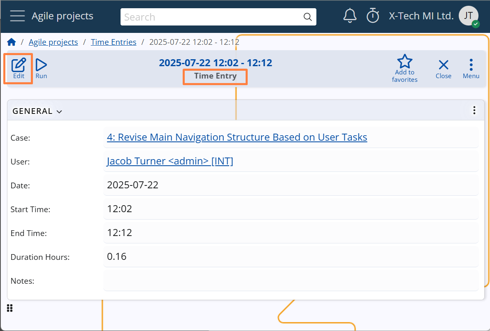
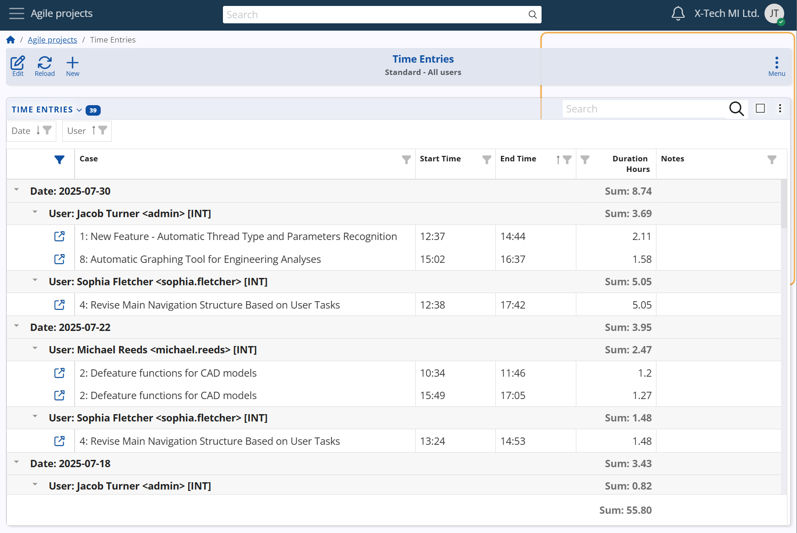

## Time tracking

The **Time tracking** feature in @@name's **Agile PM** module enables precise recording of the time employees spend working on individual Cases. This functionality supports:

- **Workforce management and accountability**
- **Analysis of workloads and identification of time-intensive Case types**
- **Calculation of project costs based on invested work hours**

### Starting and stopping the timer

Time tracking is always initiated from the **Case form**. A timer button appears in the title bar when no other session is active, or when the active timer corresponds to the current Case. Clicking this button starts or stops the timer, creating or completing a time entry accordingly.

Once tracking is active, the session can be stopped either from the **Case form where the timer was started** or from the **navigation bar**, via the timer icon and its dropdown menu. This design allows users to stop the timer regardless of where they are in the system. For example, if they have navigated away from the Case while continuing work, there's no need to return to the original Case form just to end the session.

### Timer menu

The timer icon in both the **Case form** and the **navigation bar** includes a dropdown menu with time tracking actions. The available options vary depending on whether a time tracking session is currently active.

- **When _time tracking_ is active:**
  - **Stop working on case** – ends the currently active time entry.
  - **Add note to time entry** – allows users to quickly add a short comment describing the work performed during the session.

  - **Open the current time entry** – opens the full form of the ongoing time entry, where users can review or edit additional details such as duration, notes, or related data.
  
  - **View timesheet** – shows all time entries for the current user for today. If accessed via the button in the **Case form**, the timesheet is filtered to display only the entries related to that specific Case.
  
  - **_(Navigation bar only): Open case_** – provides a quick way to return to the Case being tracked, especially if the user has navigated elsewhere in the system.

- **When no session is active:**

  - **Open the last time entry** – provides access to the most recent entry, allowing users to review or edit it in case it was left incomplete or requires further details.
  
  - **View timesheet** – shows all time entries for the current user for today.

These menu options help users manage their time tracking efficiently without leaving their current context, ensuring flexibility and accuracy in daily work reporting.

### Managing Time Entries

To maintain accuracy and flexibility in time tracking, the system supports both manual adjustments and automated mechanisms for handling time entries.

- **Manual adjustments**  
  Users can manually edit the **start** and **end** times of any time entry. They can also change the **related Case**, in case the time was logged against the wrong item.  
  This is useful when the timer was started or stopped too early or too late, when the entry needs to reflect work done outside real-time logging, or when it was linked to the wrong Case.

  

- **Automatic closure**  
  A system job named **"Complete unfinished time entries"** (`J38458`) is automatically created in the system. It runs nightly and completes time entries whose **Date is at least one day old**, by setting their **End Time** field to 23:59.

This ensures that time entries do not remain open indefinitely and helps maintain accurate reporting.  
The job runs automatically but can also be executed manually when needed — for example, to immediately close older entries left open by mistake.

*Detailed information about the job can be found here: [J38458 Complete unfinished time entries](/advanced/jobs/J38458.md)*

### Reports and timesheets

Time tracking data can be analyzed through the **Time Entries** navigator in the **Agile PM** module. This interface provides managers with a flexible and detailed view of all logged time, with support for dynamic grouping and filtering.

One of the key tools in these reports is the calculated field **Duration Hours**, which automatically shows how long each time entry lasted — providing a consistent basis for analysis across Cases, users, and projects.

This helps managers to:

- Analyze effort distribution
- Identify time-intensive work
- Evaluate performance
- Calculate project costs based on actual hours worked

This flexible reporting view supports informed decision-making, promotes transparency, and improves planning accuracy across Agile teams.

