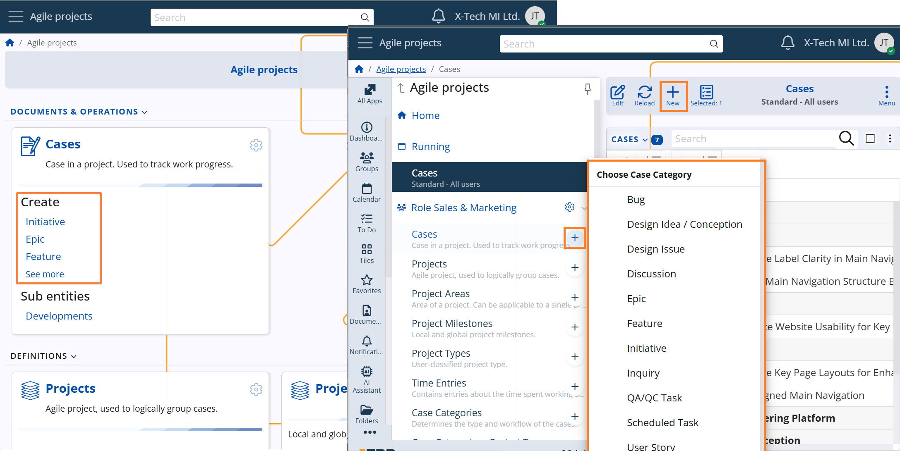
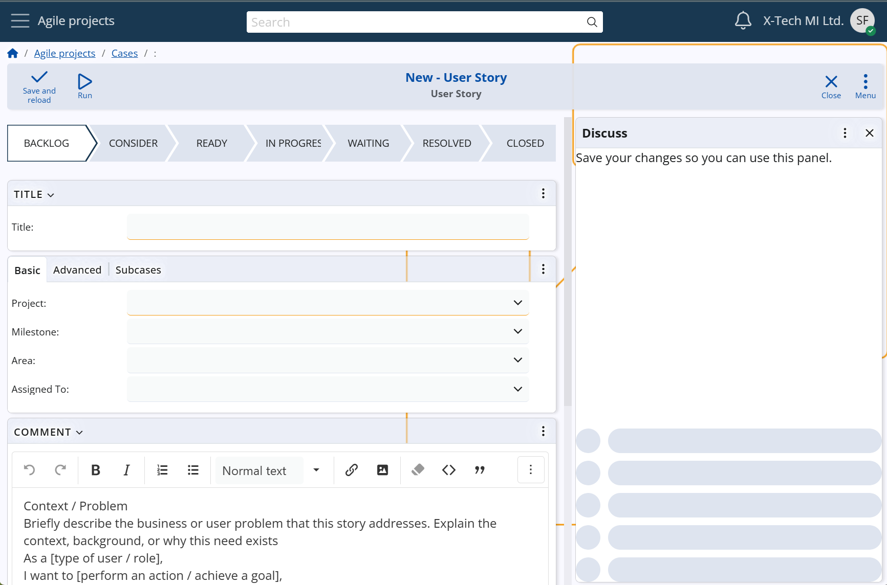
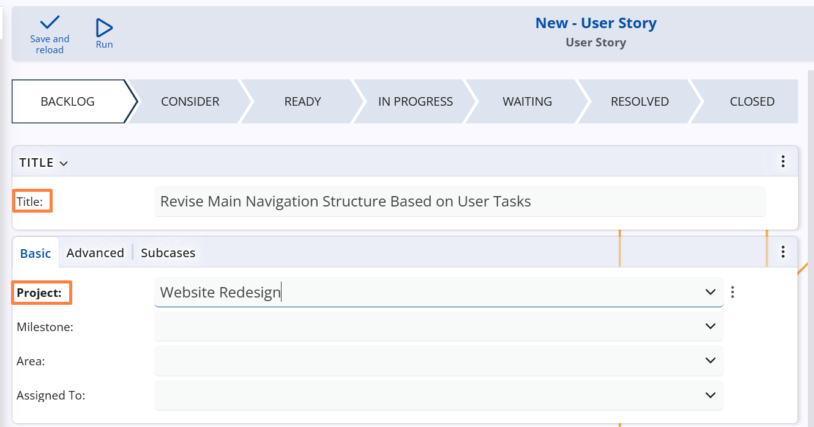
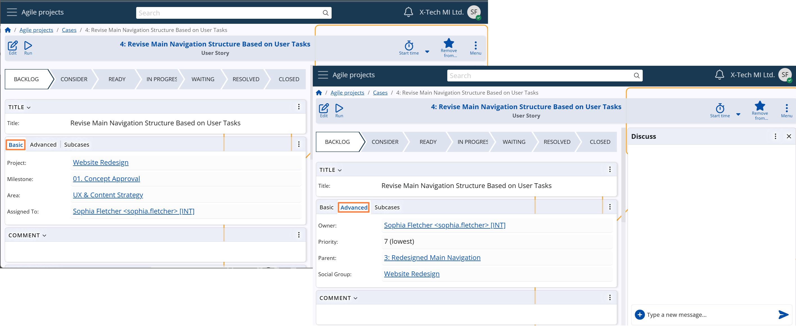

## Case creation

### Category selection

Before a Case is created, the user must first select a **Case Category**. This initial choice defines the Case’s purpose and structural behavior within the system.

Users can initiate Case creation from several entry points:
- From the **Home screen** – via direct shortcuts for the predefined Case Categories  
- From the **Cases navigator** or **Side menu** – by clicking the "+" button, listing all available active Case Categories

Once a Case Category is selected, the system initiates a new Case form, preconfigured with the logic, layout, and validations defined for that category.

The **Case Category** controls both the structure and logic of the Case form – including visible fields and panels, applicable system and user states, required parent settings, and allowed project types. This ensures consistency with internal processes and helps users provide only the relevant information, reducing clutter and improving efficiency.

*For full configuration details of Case Categories, see Case Categories.*

### Initialization

When initializing a new Case, users are required to provide two key pieces of information:
- the **Project** to which the Case belongs  
- a short **Title**, which serves as the Case’s primary identifier in lists and reports

> [!Note]
> The Project dropdown lists only those Projects that belong to a Project Type explicitly allowed for the selected Case Category. This ensures logical consistency and prevents cases from being linked to incompatible projects.    
> *For configuration details, see Case Categories → Main Settings → Allowed Project Types.*

In addition, the system automatically generates a unique Case number to ensure consistent identification across the Agile PM module.

Beyond these required elements, users are encouraged to complete additional fields to better position the Case within the organization’s workflow. The set of available fields depends on the selected Case Category, which controls the form layout.

### Case fields grouped by purpose

#### Project context
- **Area** (System name: `Project Area`) – a subdivision within the project for more precise categorization  
- **Milestone** (System name: `Project Milestone`) – a key phase or delivery checkpoint that the Case supports

#### Assignment and responsibility
- **Owner** (System name: `Owner User`) – the person ultimately responsible for the Case *(required; defaults to creator)*  
- **Assigned To** (System name: `Assigned To User`) – the user currently expected to work on the Case  
- **Social Group** – the team or department involved in discussions and execution

#### Time and planning
- **Due Date and Time** – the expected completion deadline  
- **Estimated Time Hours** – a forecast of the time required to complete the task  
- **Priority** – from 7 (lowest) to 1 (highest), used to triage tasks and focus effort

#### Stakeholder involvement
- **Stakeholder Party** – an internal or external party with a vested interest in the outcome of the Case

#### Relationships and linking
- **Parent** – allows the Case to be structured as a sub-case of another  
- **Duplicate Of Case** – optionally links the Case to another one it duplicates

Although the fields above are grouped by purpose for clarity, the actual Case form — in its fabric layout — organizes them into two main interface tabs: **Basic** and **Advanced**.

> [!Note]
> Thе fabric layout of the Case form is the standard configuration provided by the system.    
> Its actual content and structure may vary depending on the selected Case Category and any user-defined layout settings configured for it.

