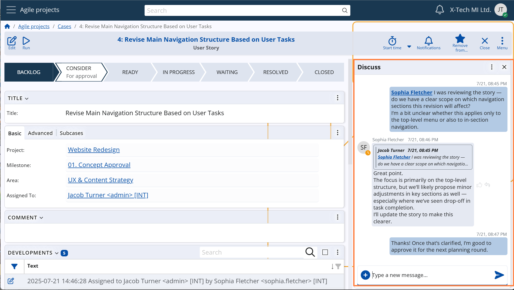
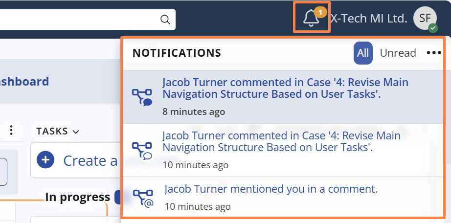
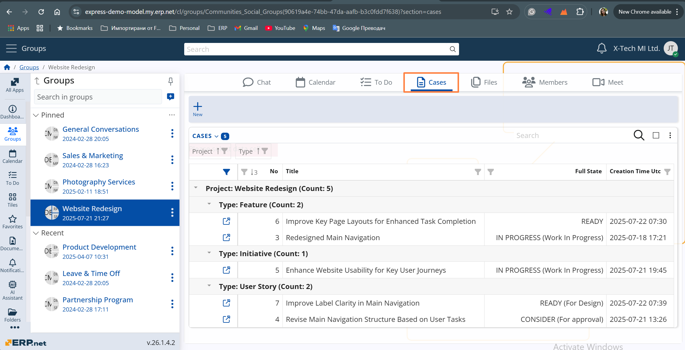

## Collaboration

### Discussions

Each Case in **Agile PM** includes a built-in **Discuss side panel** — an internal chat space where users can exchange informal comments related to the Case.  
Unlike the official log of Developments, this feature is designed for ongoing collaboration, clarification, and decision-making, without cluttering the formal history.

The Discuss panel is accessible directly from the Case form and allows team members to:

- Share progress updates, notes, and clarifications  
- Ask questions or request feedback  
- Discuss decisions informally before applying changes to the Case

When a new comment is added, all users who are tagged or who follow the Case receive a notification, ensuring that relevant stakeholders stay informed.

This feature helps maintain contextual communication within the Case, reduces reliance on external messaging tools, and simplifies future reference by keeping all discussions tied to the Case itself.

### Social Groups integration

The **Agile PM** module includes built-in integration with the **Social Groups** application of @@name to facilitate collaboration and ensure access to relevant project-related communication.

The connection between a Case and its working group is established through the **Social Group** field on the Case form.  
This field can be selected manually from a dropdown list of available Social Groups, but is typically populated automatically by the system according to the following logic:

- If the selected **Project Area** has an associated Social Group, it is assigned to the Case  
- If no group is defined at the Project Area level, the system assigns the group from the **Project**

This ensures that each Case is linked to the most contextually appropriate team space.

Users can click the link in the **Social Group** field in the Case form to open a side panel. From there, they can select **Open** to access the full group in the Groups application, where they can view discussions, files, and additional context related to the broader initiative.

Additionally, a dedicated **Cases** tab in the **Groups** app lists all cases linked to the group and allows direct creation of new cases, which are automatically associated with the current group.

