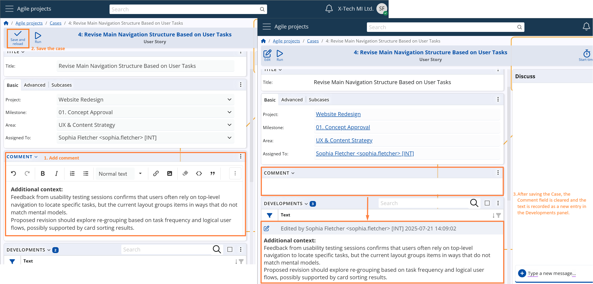
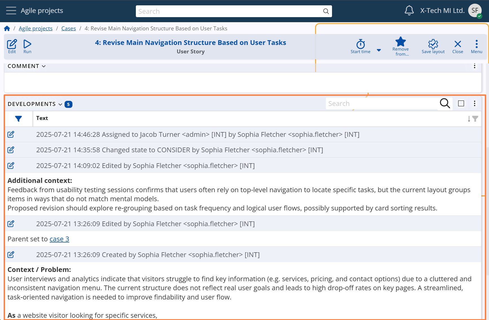
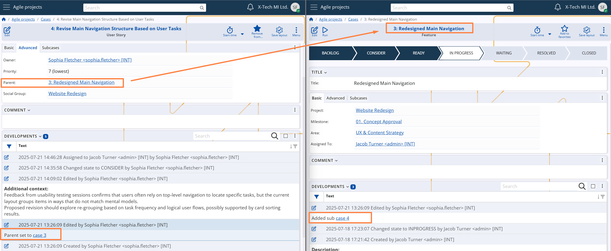
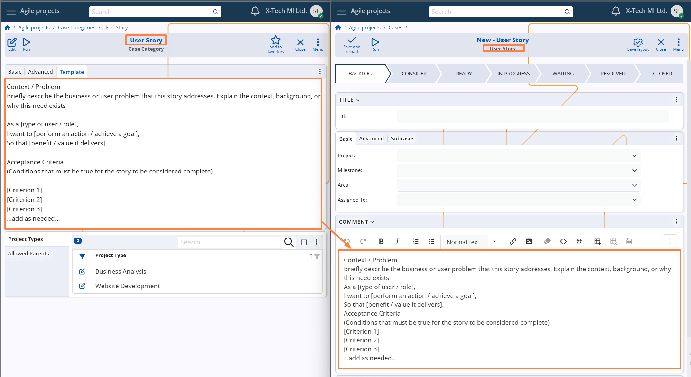

## Comments & Developments

Each Case includes a **Comment** field *(System name: `Description`)*, which allows users to enter structured text using formatting tools — such as headings, bullet points, attachments, and images. This enables a clear and detailed overview of the task at hand.

When a user writes in the Comment field and saves the Case, the system automatically creates an entry in the **Developments** panel, recording the input along with the author and timestamp. After saving, the Description field is cleared, allowing users to continue documenting progress in subsequent updates.

The screenshots below show this process — from writing the comment to seeing it registered as a structured development log.

The **Developments** panel serves as the complete activity history of the Case.  
It automatically logs:

- The initial Case creation  
- All Comment entries  
- System State changes  
- Changes to the Assigned To User  
- Changes to the Parent Case

This mechanism ensures transparency, traceability, and auditability throughout the Case lifecycle — from creation to closure.

When the **Parent** field is modified, development records are generated not only for the current Case, but also for the affected parent(s). These entries indicate the establishment or removal of a sub-case relationship, ensuring full traceability across hierarchical structures.

*For more details on how case hierarchies work and how the **Parent** field influences structure and inheritance, see section [Relationships & hierarchy](relationships-and-hierarchy.md).*

### Description Templates

When creating a new Case, the **Description** field may be automatically populated with a predefined **template**, depending on the configuration of the selected Case Category.

This template is meant to guide users in providing a structured, consistent, and clear description of the Case. It may include:

- Placeholder phrases (e.g., "As a [user], I want to [action], so that [goal]")
- Formatting guidelines
- System variables

Users are free to edit or replace the template content before saving the Case.

*For setup details, see [Case Categories –> Advanced Settings –> Description Template](../configuration-and-structure/main-setup/case-categories.md#description-template)*

