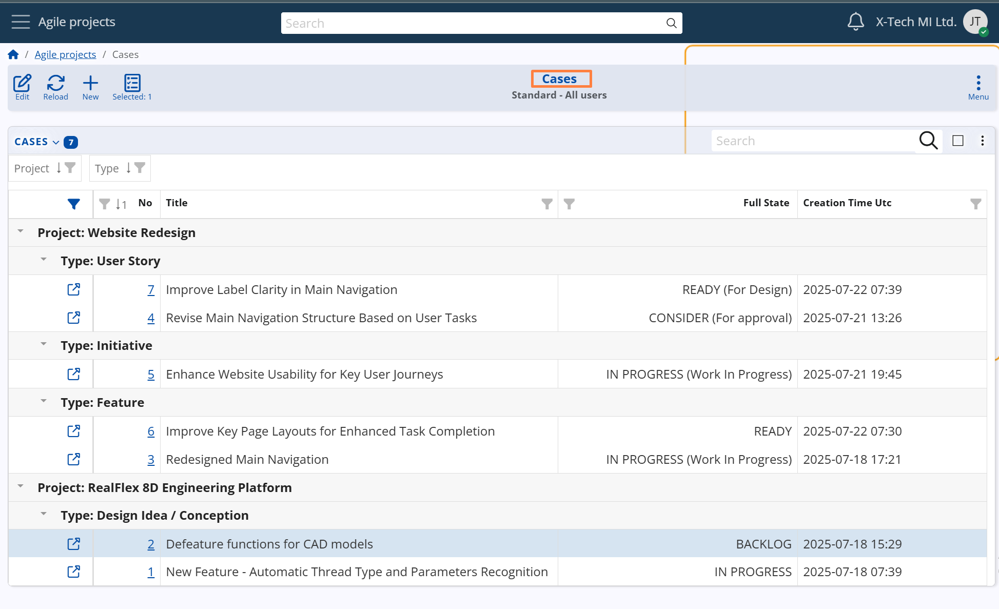

## Cases

**Cases** are the core operational unit in the **Agile PM** module of @@name. They represent individual tasks or work items that collectively contribute to the execution of a project — whether internal or external. Each Case acts as a self-contained document that tracks the progress, communication, and activity history related to a single task.

A Case evolves as work is performed. It starts with an initial definition, progresses through various workflow stages, and is eventually closed when the task is completed and verified.

The screenshot below shows the Cases navigator, grouped by Project and Case Type (Case Category), providing a structured overview of all ongoing work items.

 

The sections that follow cover the full lifecycle of a Case and its supporting functionality:

- [Case creation](case-creation.md)
- [Comments & Developments](comments-and-developments.md)
- [Workflow states](workflow-states.md)
- [Responsibility, priority and time logging](resp-priority-time-logging.md)
- [WIP (work-in-progress) limits](wip-limits.md)
- [Collaboration](collaboration.md)
- [Notifications](notifications.md)
- [Supporting tools](supporting-tools.md)
- [Relationships & hierarchy](relationships-and-hierarchy.md)
