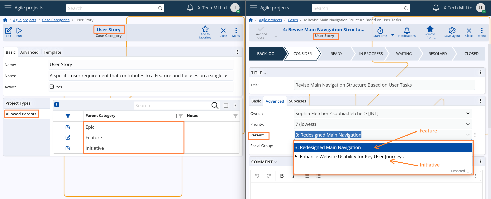
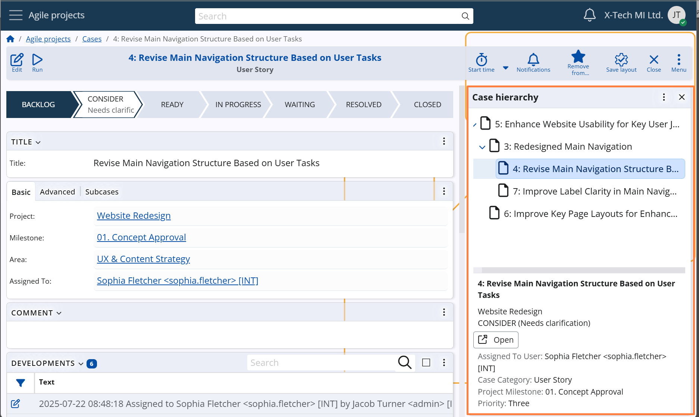

## Relationships & hierarchy

### Parent case logic

Cases in **Agile PM** can be structured in hierarchical relationships, allowing teams to break down complex work into smaller, interrelated tasks.

A relationship is established when a Case is linked to a parent Case via the **Parent** field.

The **Parent** dropdown lists only those Cases whose **Category is explicitly allowed** to act as a parent to the **Category of the current Case**, based on the configured category relationship rules.  
These rules are defined at the Case Category level to enforce logical and consistent structures.
*For configuration details, see Case Categories –> Main settings –> Allowed parent categories*.

 

When a parent Case is selected, the following project-related fields are automatically populated with the corresponding values from the parent Case *(if still empty in the current Case)*:  
**Project, Project Area, and Project Milestone.**  
This ensures consistency across sub-cases, reduces manual input, and streamlines the subcase creation process.

> [!Note]
> If the selected Case Category is configured with the **Requires Parent** option, the system enforces a validation rule that ensures the **Parent** field is populated before the Case can be saved.  
> *For configuration details, see Case Categories –> Advanced settings –> Requires parent setting.*

### Case Hierarchy panel

A visual hierarchy is available through the **Case hierarchy** side panel.  
This panel displays the full structure of parent and subcases — from the top-level (root) case down to the most deeply nested items.

The tree is built using the **Parent** field and shows key details for each Case when selected, including its state, assignee, category, milestone, and priority.

The dedicated hierarchy panel is available in the side menu of both the Case navigator and the Case form.

 
