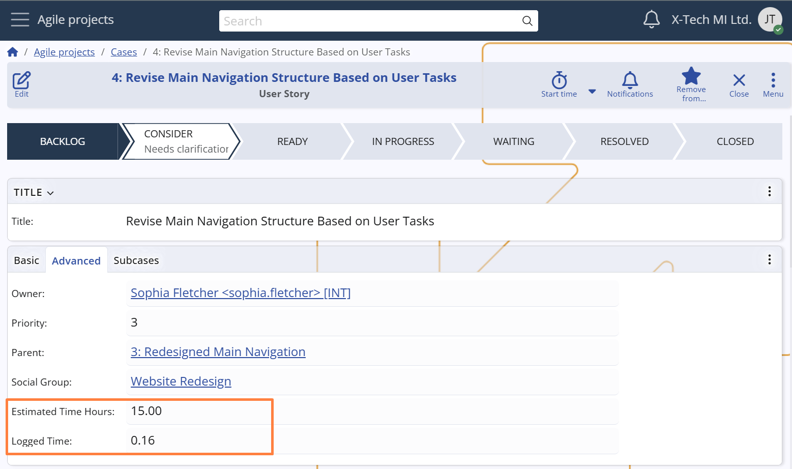

## Responsibility, priority and time logging

### Ownership and assignment

Each Case includes two distinct roles that help define responsibility and execution:

- **Owner** – the user ultimately responsible for the Case.  
- **Assigned user** – the user currently expected to work on and progress the Case.

By default, the **Owner** is automatically set to the user who creates the Case. However, ownership can be manually changed to delegate responsibility — for example, when a supervisor creates a Case on behalf of a colleague.

The **Assigned To** field *(System name: `Assigned To User`)* specifies the person actively working on the Case at any given time. This enables clear task ownership at the execution level and helps manage workloads across team members.

This separation between ownership and assignment supports flexible workflows, including delegation, escalation, and collaborative execution.  
For instance, a Case might be created and owned by a project lead but assigned to a team member for execution.

The **Assigned To** field can be populated either manually or automatically through user-defined **Assignment Rules** — a system for defining routing logic based on project, states, category, and other contextual criteria.  
This helps streamline operations by reducing manual effort and ensuring Cases are assigned to the right person.  
*For configuration and automation options, see Assignment Rules.*

> [!Note]
> When a Case is transitioned to the **Resolved** state, the system automatically reassigns it to its **Owner**.  
> This ensures that the responsible person reviews or finalizes the Case before closure.

### Priority

Each Case has a **Priority** field used to indicate its urgency and importance within the project.  
The values range from **7** (lowest) to **1** (highest), enabling teams to triage tasks and allocate resources accordingly.

The Priority can be set manually when creating or editing a Case, but the system also adjusts it automatically in specific scenarios — for example, if the initial priority is **3** or higher and the Case enters the **In Progress** state, it is updated to **2**.
This mechanism helps surface more critical tasks once they are actively being worked on, ensuring they receive the appropriate level of attention.

### Logged Time

The **Logged Time** field displays the total duration of work logged via Time Entries for the Case.  
It offers immediate insight into the actual effort invested, supporting both progress tracking and retrospective analysis.

In combination with the **Estimated Time Hours** field — which captures the initial time expectation for completing the Case — users and managers can evaluate how accurately the effort was projected, identify underestimations, and refine future planning.

*For more details about time tracking and Time Entry creation, see Time Tracking.*

