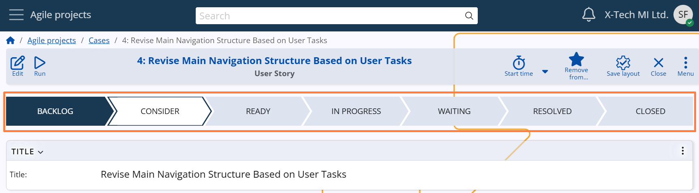

## Workflow states

### System States

Each Case progresses through a predefined set of **System States**, reflecting its current stage in the workflow. These states guide users through the lifecycle of the task — from initial planning to resolution and closure.

The standard System States are:

**Backlog → Consider → Ready → In Progress → Waiting → Resolved → Closed**

- **Backlog** – the initial state where the Case is drafted. It typically contains a description of the issue or request.
- **Consider** – used for analysis, planning, or review before committing to work.
- **Ready** – signals that the Case is approved and ready to be started.
- **In Progress** – indicates that work on the Case has begun.
- **Waiting** – temporarily halts progress, usually due to pending feedback or external dependencies.
- **Resolved** – work on the Case is completed, awaiting final review or closure.
- **Closed** – the Case is finalized. Once closed, it becomes read-only and cannot be edited.

> [!Note]
> Some System States may be hidden in the Case form, depending on the Case Category configuration.  
> *For details, see Case Categories –> Advanced Settings –> Visibility of System States.*

Users can move Cases forward or backward between states, depending on workflow permissions and process requirements.

> [!Note]
> A Case must always transition through **Resolved** before it can be **Closed**, ensuring that all necessary work is reviewed and finalized before the Case becomes final and read-only.

### User States

While System States define the main lifecycle stages, **User States** provide more granular control and reflect the internal processes within each stage.

When a System State has applicable User States (based on the Case Category), the user is prompted to select a sub-stage from a dropdown menu when changing the Case state.  
This allows users to add more context, such as:

- "For approval" or "Needs a meeting" for the **Consider** state  
- "Ready for design" or "Ready for execution" for the **Ready** state  
- "Completed" or "Rejected" for the **Resolved** state

This functionality helps teams reflect the true status of work more precisely, without modifying the core state logic.

> [!Note]
> User States are optional and appear only when defined for the selected System State and Case Category.  
> *For configuration details and setup instructions, see [User States](../configuration-and-structure/main-setup/user-states.md).*

