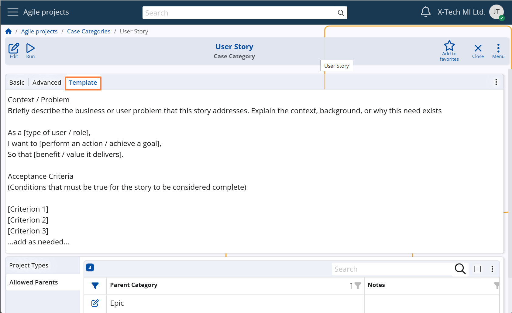

## Case Categories

Once [Project Types](../project-types.md) have been defined, the next essential step in setting up **Agile PM** is to define the Case Categories — a required element before any Cases can be created.  
**Case Category** is a classification unit that groups Cases with a similar purpose, structure, or role within the workflow. It is used for:

- Organizing and classifying individual Cases  
- Reflecting the internal workflow logic of the organization

Typical examples include bugs, features, enhancements, user stories, scheduled tasks, feedback, internal discussions, etc.

## Main settings

### Allowed Project Types

Each Case Category must be explicitly linked to one or more **Project Types**.  
This means that a Case of a given Category can only be associated with Projects of an allowed type.

**For example:**

- The "User Story" category may allow Cases to be created only in Projects of type:
  - Business Analysis  
  - Website Development

- A Project of type Marketing Campaign will not appear in the selection list when creating a User Story.

This setup ensures consistency across the system and prevents Case misclassification.

**Configuration path:** *Case Category definition → Project Types panel*

### Allowed Parent Categories

When defining a Case Category, it is also possible to specify which other Case Categories are allowed to act as parents for this Category.  
This enables organizations to control the hierarchy of Cases based on business logic.

**For example:**
- A Case of category "User Story" may only be allowed to be subordinated to parent Cases from categories such as:
  - User Story  
  - Feature  
  - Epic  
  - Feature  
  - Initiative
- It would typically not be allowed to have another User Story as a parent, unless explicitly configured.

These parent-child rules ensure logical structure and prevent recursive or nonsensical relationships between Cases.

**Configuration path:** *Case Category definition → Allowed Parents panel*  
*Display panel name:* `Allowed Parents`  
*System panel name:* `Relationships`

**Examples of Case Categories with their allowed Project Types and parent context**

| **Case Category**     | **Allowed Project Types**                             | **Allowed Parent Categories**         |
|-----------------------|--------------------------------------------------------|----------------------------------------|
| Bug                   | Product Development                                    | User Story, Feature, Epic              |
| Feature               | Product Development                                    | Epic, Initiative                       |
| User Story            | Product Development Website Development            | Epic, Initiative                       |
| QA Task               | Product Development Client Implementation          | Feature                                |
| Discussion            | Client Implementation Process Optimization         | Epic, Initiative, Feature              |
| Scheduled Task        | Process Optimization Client Implementation         | –                                      |
| Social Media Task     | Social Media Strategy                                  | Campaign Concept, Initiative           |
| Campaign Concept      | Social Media Strategy                                  | Initiative                             |

## Advanced settings

### Requires parent setting

Each Case Category can specify whether a parent Case is mandatory when creating a new Case of that category.  
This is controlled by the Requires Parent setting in the Case Category definition.

- If the Requires Parent field is checked, the system will validate that the Parent field is populated when the Case is saved.
- If the field is not checked, a Case can be created without a parent.

This setting helps enforce hierarchical consistency, especially in workflows where certain types of Cases must always be linked to broader context items such as User Stories, Features, or Epics.

**Configuration path:** *Case Category definition → Advanced panel → Requires Parent field*  
*Display panel name:* `Advanced`   
*System panel name:* `Case Category`

### Visibility of System States

The visibility of System States in the status bar of a Case form can be controlled via the *Hide Unused System States* option in the Case Category definition.

- When enabled, only System States that have at least one defined and active User State will be visible in the Case form.
- When disabled (which is the default), all System States are shown, even if no User States are assigned to them.

This setting is useful in workflows where certain System States are not applicable.  
Hiding unused states improves clarity and reduces interface noise — especially in teams that rely on a simplified or custom progression of work.

It also supports a gradual rollout of User States:

- Initially, teams may define only a few User States while keeping all System States visible.
- Later, once the complete User State model is configured, the *Hide Unused System States* option can be activated to hide irrelevant system states and finalize the workflow experience.

*(For more on System States, see section … For User States, see section …)*

**Configuration path:** *Case Category definition → Advanced panel → Hide Unused System States field*  
*Display panel name:* `Advanced` 
*System panel name:* `Case Category`

### Description Template

Each Case Category can include a description template — a block of predefined text that is automatically displayed when a new Case of that category is created.  
This template is defined in the Description Template field within the Case Category setup.

The purpose of the template is to help users describe the Case in a structured, unified, and consistent manner.

- It may include formatting guidelines, placeholder phrases, and system variables
- Users can modify the content as needed when entering the details of a specific Case

**Example:**  
For a User Story category, the template might include:

> As a [type of user/role],
> I want to [perform an action / achieve a goal],  
> So that [benefit/value it delivers]

**Configuration path:** *Case Category definition → Template panel* 
*Display panel name:* `Template` 
*System panel name:* `Case Category (Description Template field)`

