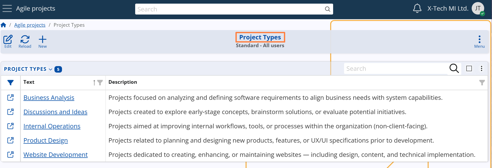

## Project Types

Projects in **Agile PM** are specific initiatives that always belong to a **Project Type**.  
**Project Types are required for creating Projects in Agile PM.**

Each Project Type represents a general category of projects that share common goals, structure, or internal classification.

**For example:** 
A marketing agency may frequently work on websites or digital campaigns. In this case, "Website Development" or "Social Media Strategy" could be defined as Project Types.

> [!Note]
> A Project Type is not:
> - a business division  
> - a specific product or service  
> - a particular project  
> 
> Instead, it is a high-level classification of project nature based on the organization’s internal taxonomy.

**Examples of Project Types and Projects by industry:**

| **Project Type**         | **Project**                                              | **Industry**               |
|--------------------------|----------------------------------------------------------|----------------------------|
| Social Media Strategy    | Instagram Ads Q3 Launch TikTok Teasers                | Marketing Agency           |
| Process Optimization     | Loan Workflow Automation HR Onboarding Streamline     | Banking / Corporate        |
| Product Development      | Time Tracker App Client Portal UI Revamp              | Software Development       |
| Client Implementation    | ERP Setup GreenEnergy CRM Rollout for EcoSoft         | IT / ERP Services          |
| Website Development      | Corporate Website Redesign Landing Page Generator     | Digital / Web Services     |

