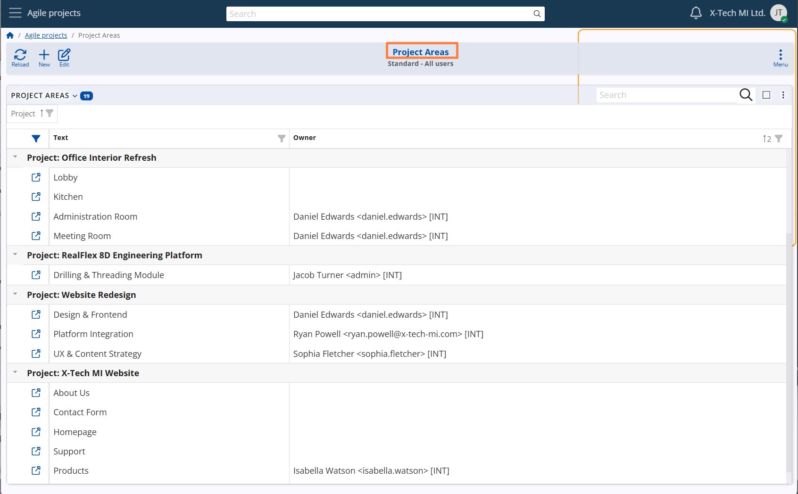

## Project Areas

A **Project Area** in **Agile PM** represents a distinct structural unit within a [Project](projects.md), typically focused on a specific part of the overall work.  
It is used to divide a Project into smaller, more manageable components that can be handled independently, either by different teams or based on specialized responsibilities.

Each Project Area can be defined at different levels, depending on the desired scope:  
- specific to a single Project,  
- shared across a Project Group, or  
- global, valid for all Projects and Groups in the system.  

**For example**:
A project of type **Client Implementation** may include Areas such as **Data Migration**, **System Configuration**, and **User Training**. Alternatively, a project group such as **Marketing Projects** may include shared areas like **Campaigns** and **Content Creation**, available to all projects in that group.

> [!Note]  
> The scope of a Project Area depends on the combination of the **Project** and **Project Group** fields:  
> • If **Project** is selected, the Area applies only to that Project.  
> • If **Project** is empty but **Project Group** is selected, the Area applies to all Projects in that group.  
> • If both fields are empty, the Area is considered **global**, valid across the entire Agile PM module.  

**Configuration path:** *Project Area definition → Advanced panel → Project and Project Group fields*  
*Display panel name:* `Advanced` 
*System panel name:* `Project Area`

### Responsibility and collaboration settings

Each Project Area may have a designated **Owner** — the person responsible for overseeing and coordinating the work within that Area.  
A **Social Group** can also be assigned to the Project Area — just like in [Projects](projects.md) — to represent the team or department involved in discussions and decisions related to that area.  
This helps ensure accountability, collaboration, and clear ownership over specific sections of the project.

**Configuration path:**
- *Project Area definition → Basic panel → Owner field*  
  *Display panel name:* `Basic` 
  *System panel name:* `Project Area` 
  *Display field name:* `Owner` 
  *System field name:* `Primary User`

- *Project Area definition → Advanced panel → Social Group field*  
  *Display panel name:* `Advanced` 
  *System panel name:* `Project Area`

### WIP (work-in-progress) Limits

Like [Projects](projects.md), Project Areas may also use WIP Limits to control the number of Cases that are allowed to remain in specific workflow states within that Area.  
These limits are applied **per Project Area**, and they function independently from the WIP limits defined at the Project level.  
This mechanism ensures that each Area of the project stays manageable and avoids bottlenecks.

A separate WIP limit can be defined for each of the following System States:  
**CONSIDER, READY, IN PROGRESS**

If a limit is exceeded, the system will block transitions to the respective state until the number of Cases in that state within the same Project Area in the Case’s Project falls below the defined limit.

**Configuration path:** *Project Area Definition → WIP Limits panel → Consider, Ready, and In Progress fields*  
*Display panel name:* `WIP Limits`   
*System panel name:* `Project` 
*Display field name:* `Consider`, `Ready`, and `In Progress` fields  
*System field name:* `Consider WIP Limit`, `Ready WIP Limit`, and `In Progress WIP Limit` fields

