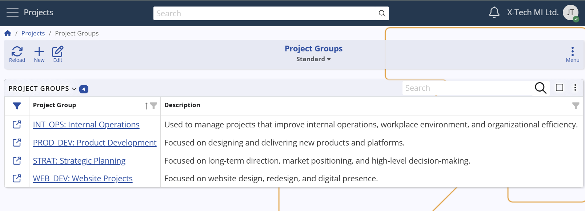
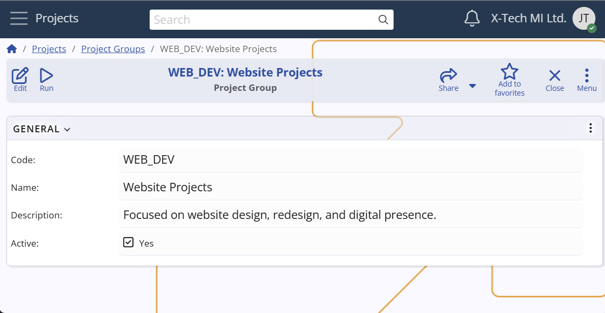

## Project Groups

A **Project Group** in **Agile PM** represents a logical grouping of Projects that share common configurations such as [Project Areas](project-areas.md) and [Project Milestones](project-milestones.md).  
They provide a way to centrally manage shared structures across related Projects, without making them global for all Projects and Groups.  

**For example**: 
A company manages various projects — such as Website Redesign, Campaign Launch, SEO Optimization, Mobile App, API Platform, and Reporting Module.  

Some of these projects share common structures that are not relevant to the others.  
Instead of duplicating the same areas and milestones in each project, or defining them globally where they would appear in unrelated projects, the company can organize them into **Project Groups**.  

In this case, the company might define:  
- a **Marketing Projects** group for Website Redesign, Campaign Launch, and SEO Optimization  
- a **Product Development Projects** group for Mobile App, API Platform, and Reporting Module  

This way, marketing projects can share milestones like "Campaign Live", while product development projects can share areas like "Release Management", without interfering with each other.

### Creating a Project Group
Defining a Project Group is a simple process — you only need to provide:  
- a **Code** (unique identifier),  
- a **Name**,  
- and optionally a **Description** of the group’s scope or purpose.  

This makes Project Groups lightweight structures that are easy to set up and maintain.  

However, to use Project Groups effectively, at least one Project should be associated with them.  
Without assigned Projects, a Project Group exists as a definition but does not provide practical benefits.

**Configuration path:** *Project Group definition → General panel → Code, Name and Description fields*  
*Display panel name:* `General`  
*System panel name:* `Project Group`  

## Relations
- **Projects** – a Project may optionally be associated with one Project Group  
- **Project Areas** – can be linked to a Project Group; in this case they apply to all Projects in the group  
- **Project Milestones** – can be linked to a Project Group; in this case they apply to all Projects in the group  

