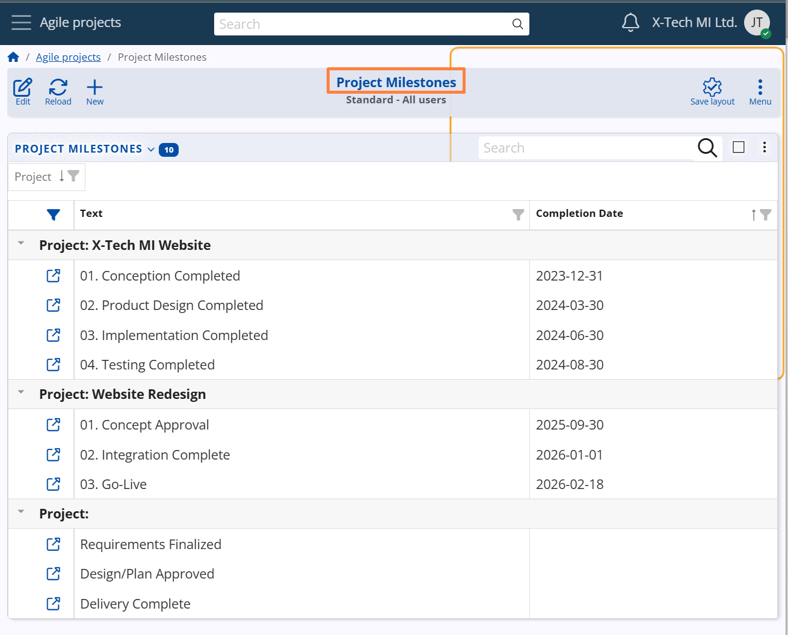
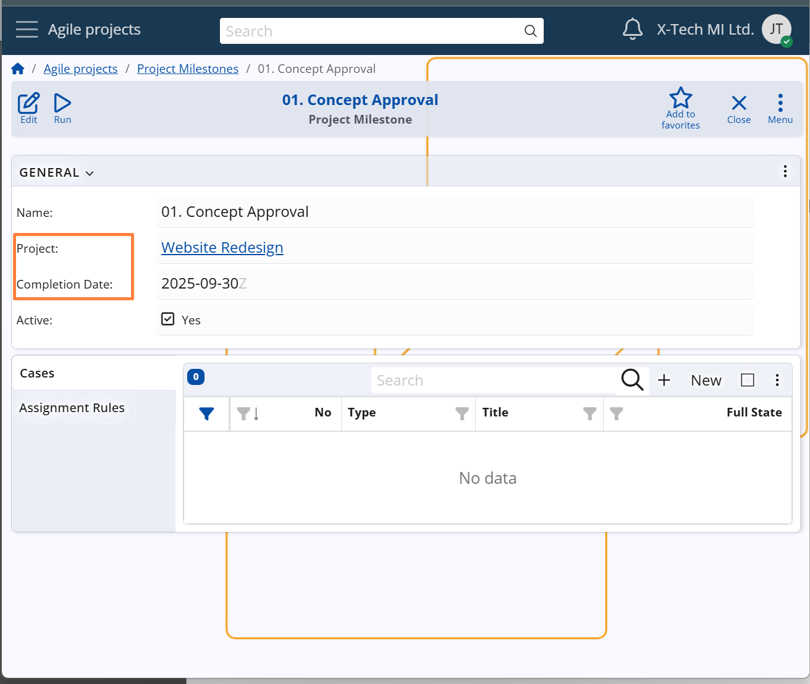

## Project Milestones

Project Milestones in @@name represent significant checkpoints within a Project — key dates or events that help teams monitor progress, align expectations, and prepare for upcoming deliverables.

Milestones may correspond to internal or external deadlines, such as a product release, a feature freeze, a client presentation, or a critical review session.  
They do not control the sequence of work but signal important targets in the project timeline.

#### What a Milestone is *not* in Agile

A Milestone in Agile is **not**:

- A fixed deadline that marks the *end* of the entire project  
- A rigid checkpoint enforced regardless of team velocity or feedback  
- A traditional Gantt-style dependency or sequential barrier  
- A sign that “everything must be done” by that date  

Instead, Agile milestones are **lightweight coordination tools** that help teams focus on meaningful outcomes without introducing unnecessary rigidity.

**For example**:
A project of type **Product Development** may include Milestones such as  
**Beta Release**, **Public Launch**, or **Security Audit**, helping the team align around shared delivery goals.

Each Milestone can optionally include a **Completion Date**, which indicates the point in time by which relevant work (e.g. Cases) is expected to be completed.  
This can be used as a soft deadline to guide planning and execution.

> [!Note]
> While each Project Milestone usually references a specific Project, it is possible to define a global Milestone that can be used across all Projects.  
> To do this, simply leave the *Project* field empty.

**Configuration path:** *Project Milestone definition → General panel → Project and Completion Date fields*  
*Display panel name:* **General**  
*System panel name:* **Project Milestone**

