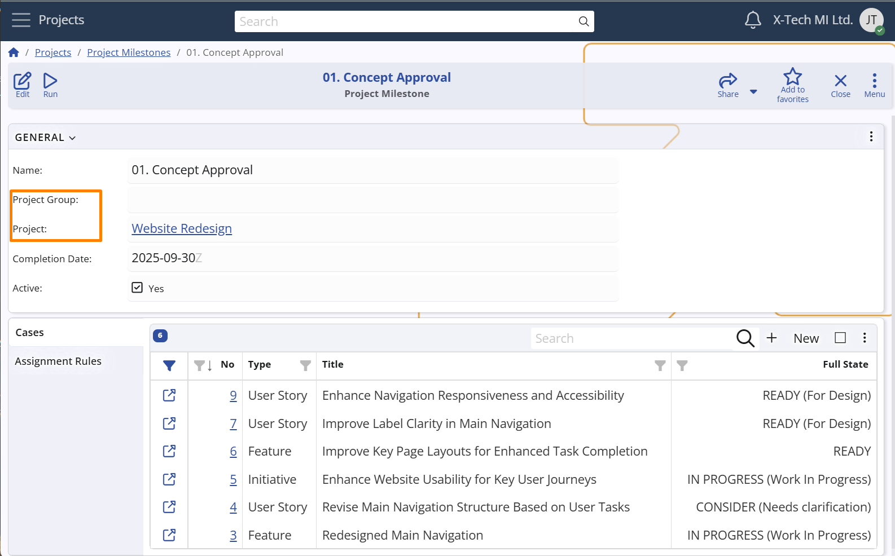

## Project Milestones

**Project Milestones** in **Agile PM** represent significant checkpoints — key dates or events that help teams monitor progress, align expectations, and prepare for upcoming deliverables.  

They may correspond to internal or external deadlines, such as a product release, a feature freeze, a client presentation, or a critical review session.  
Milestones do not control the sequence of work but signal important targets in the project timeline.

#### What a Milestone is *not* in Agile

A Milestone in Agile is **not**:

- A fixed deadline that marks the *end* of the entire project  
- A rigid checkpoint enforced regardless of team velocity or feedback  
- A traditional Gantt-style dependency or sequential barrier  
- A sign that "everything must be done" by that date  

Instead, Agile milestones are **lightweight coordination tools** that help teams focus on meaningful outcomes without introducing unnecessary rigidity.

### Scope levels

Each Project Milestone can be defined at different levels, depending on the desired scope:
- specific to a single Project,  
- shared across a Project Group, or  
- global, valid for all Projects and Groups in the system.  

> [!Note]  
> The scope of a Project Milestone depends on the combination of the **Project** and **Project Group** fields:  
> • If **Project** is selected, the Milestone applies only to that Project.  
> • If **Project** is empty but **Project Group** is selected, the Milestone applies to all Projects in that group.  
> • If both fields are empty, the Milestone is considered **global**, valid across the entire Agile PM module.

**For example**:
A **Product Development** project may include milestones such as **Beta Release**, **Public Launch**, or **Security Audit**, helping the team align around shared delivery goals.  Alternatively, a project group such as **Marketing Projects** may define shared milestones like **Campaign Kickoff** or **Annual Review**, available to all projects in that group.

**Configuration path:** *Project Milestone definition → Advanced panel → Project and Project Group fields*  
*Display panel name:* `Advanced` 
*System panel name:* `Project Milestone`

## Additional properties

Each Milestone can optionally include a **Completion Date**, which indicates the point in time by which relevant work (e.g. [Cases](../../cases/index.md)) is expected to be completed.  
This can be used as a soft deadline to guide planning and execution.

**Configuration path:** *Project Milestone definition → General panel → Completion Date field*  
*Display panel name:* `General` 
*System panel name:* `Project Milestone`

