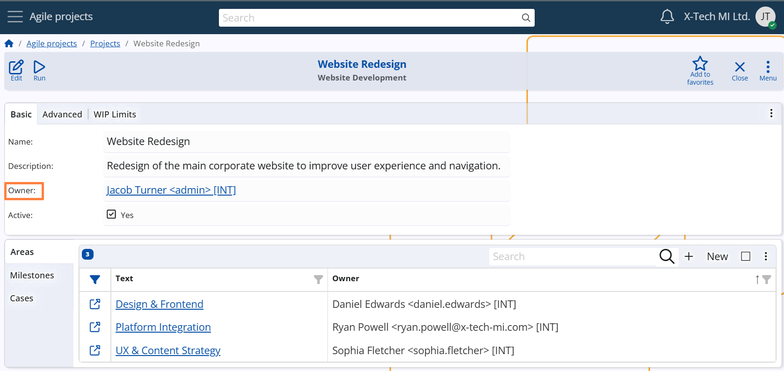

## Projects

A **Project** in @@name represents a business initiative with a defined goal – such as delivering a product, providing a service, or executing an internal improvement.  
Projects can be client-facing or internal, and they structure the work, timeline, people, and deliverables related to the initiative.

A Project can only be created if [Project Types](../main-setup/project-types.md) have already been defined.  
Each Project belongs to exactly one Project Type.

> [!Note]
> The layout of the Project form may vary depending on the selected Project Type.  
> This allows each Project to display only the fields and panels relevant to its type.  
>  
*For examples of real-world Projects and their types, see [Project Types](../main-setup/project-types.md).

### Responsibility and collaboration settings

Each Project must have a designated **Owner** — the person responsible for its execution and coordination.

**Configuration path:** *Project definition → Basic panel → Owner field*  
*Display panel name:* `Basic` 
*System panel name:* `Project` 
*Display field name:* `Owner` 
*System field name:* `Primary User`

If the Project is initiated by or serves an external party, a **Customer** can also be specified.  
However, for internal initiatives, this field may remain empty.

Optionally, a **Social Group** may be assigned to the Project.  
This group represents the team or department involved in the discussions and decision-making related to the Project.

**Configuration path:**  
*Project definition → Advanced panel → Customer and Social Group fields*  
*Display panel name:* `Advanced` 
*System panel name:* `Project`

### WIP (work-in-progress) Limits

WIP Limits are an optional tool that restricts the number of Cases that are allowed to remain in specific workflow states within a Project.  
They are designed to prevent:

- Overloading teams or individual employees  
- Cases remaining too long in the same state without progressing

WIP Limits promote balanced work distribution and support more efficient progress by encouraging smart resource allocation.

A separate WIP limit can be defined for each of the following System States:  
**CONSIDER**, **READY**, **IN PROGRESS**

If a limit is exceeded, the system will block transitions to the respective state until the number of Cases in that state within the Case’s Project is reduced.

**Configuration path:** *Project Definition → WIP Limits panel → Consider, Ready, and In Progress fields*  
*Display panel name:* `WIP Limits` 
*System panel name:* `Project` 
*Display field name:* `Consider WIP Limit`, `Ready WIP Limit`, and `In Progress WIP Limit` fields  
*System field name:* `Consider WIP Limit`, `Ready WIP Limit`, and `In Progress WIP Limit` fields

