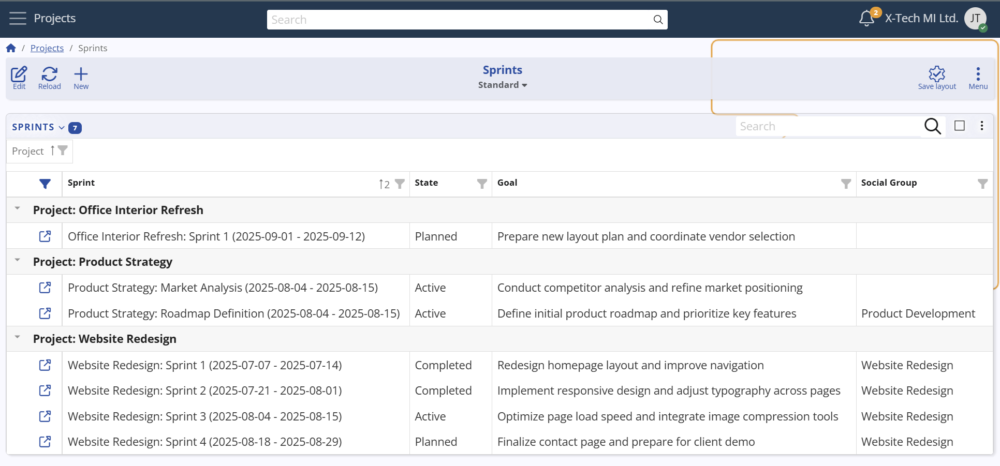
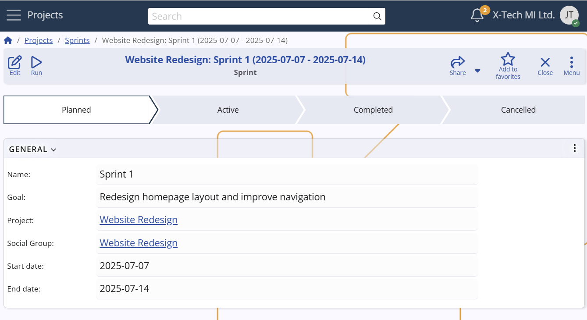

## Sprints

A **Sprint** in **Agile PM** represents a fixed timebox (typically 1–4 weeks) during which a team works to complete a set of [Cases](../../cases/index.md) toward a defined sprint goal.  
Sprints provide short, iterative cycles that support planning, progress tracking, and continuous delivery.  

They are used to:  
- Focus teams on a clear and achievable short-term goal.  
- Track velocity and predict delivery capacity over time.  
- Provide checkpoints for review, feedback, and adaptation.

### Scope and constraints  
- Each Sprint belongs to a single **Project**, and may optionally be linked to a **Social Group** (team).  
- Only one active Sprint is allowed per Project and Social Group combination, preventing overlap in execution.  
- [Cases](../../cases/index.md) can be assigned to exactly one Sprint at a time; if not assigned, they remain in the backlog.

**Configuration path:** *Sprint definition → General panel*
*Display panel name:* `General`  
*System panel name:* `Sprint`  

### Difference from Milestones  
Sprints focus on driving work forward within short, fixed cycles,  
while Milestones mark important checkpoints or delivery targets on the broader project timeline. 

**For example:**  
A Website Redesign project might define a sprint dedicated to updating the homepage layout and navigation.  
At the same time, a Product Development project could run a sprint focused on implementing a new API module.  
Each sprint has its own start and end dates, goal, and progress tracking, while still aligning with the broader project milestones.  
