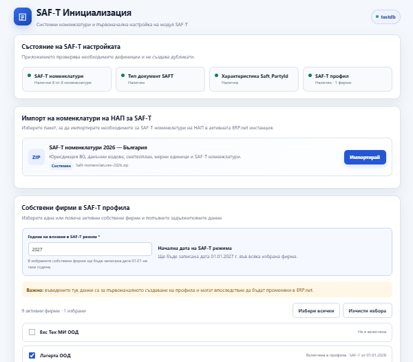
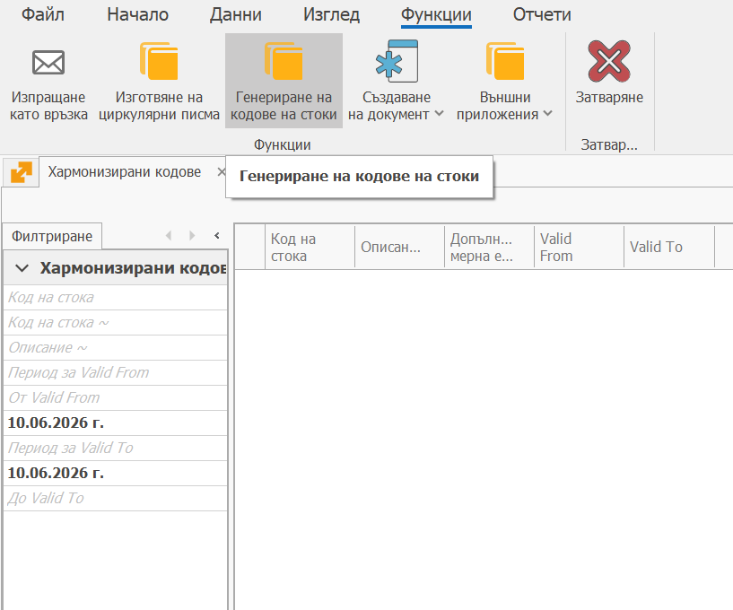

# SAF-T номенклатури на НАП

За да работят експортите на SAF-T е необходимо да се направи първоначално зареждане на предоставените номенклатури от НАП.

1. Основната част от тях могат да се заредят с помощта на приложението:

[SAF-T INITIAL SETUP BUNDLE — Community](https://operator.net/community/saf-t-initial-setup-bundle)

Трябва да се влезе с оператора в текущата инстанция и да се стартира приложението.
От секцията Импорт на номенклатури на НАП за SAF-T се импортират.

2. Освен това трябва да се заредят Хармонизираните кодове на ЕС.

Това се прави от Регулаторни / Интрастат / Хармонизирани кодове / Функции / Генериране на кодове на стоки

Тези които ползват модул Интрастат или Акциз вече са ги заредили.

