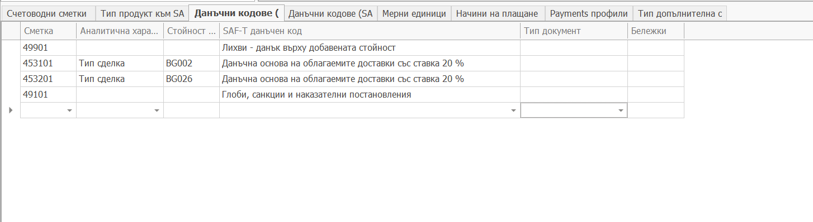

# Съответствие на счетоводни операции със SAF-T данъчни кодове

SAF-T изисква за сметките за данъци, при осчетоводяване да се посочва видът данък от списък на НАП. За целта тези сметки трябва да имат аналитичност, която директно да съответства на данъчните кодове на НАП.

В панел **Данъчни кодове (SAF-T) за счетоводни операции** на SAF-T профила се прави съответствието на конкретна аналитичност по сметка със съответен данъчен код.

Връзката е Сметка, Аналитична характеристика и Стойност на аналитична характеристика към SAF-T данъчен код от предоставения от НАП списък с данъчни кодове.

- В поле **Сметка** се избира синтетичната сметка от ERP.net.
- В поле **Аналитична характеристика** се избира тази аналитична характеристика, в която са разположени данъчните кодове или техните точни съответствия в ERP.net.
- В поле **Стойност** се избира конкретната стойност на тази аналитична характеристика, по която може еднозначно да се определи SAF-T данъчния код.
- В поле **SAF-T данъчен код** се избира SAF-T данъчния код от номенклатурата на НАП.
- В поле **Тип документ** се избира типът документ за който се отнася това осчетоводяване. Може да се пропусне ако за всички типове документи този тип продукт се осчетоводява еднакво.

Настройката на това съответствие изисква предварително дефиниране на сметките за данъци. То тези сметки по които се изисква посочване на данъчен код трябва да се настрои аналитична характеристика, която да съответства на данъчните кодове.
В повечето случаи такава аналитичност не присъства и затова трябва да се подготви нова сметка, където да се дефинира такава аналитичност.

**В частния случай със ДДС сметките 4531 и 4532 е необходимо да се настрои аналитичност по Тип сделка. А след това мапингът се прави Тип сделка - > SAF-T данъчен код.**

Това е необходимо, тъй като счетоводните статии по тези сметки се генерират автоматично и типът сделка трябва да се наследи от родителската фактура или покупна фактура. Това осчетоводяване също трябва да се настрои.
В родителските фактури отново се подава данъчен код и там източникът е Тип сделка в самите фактури.
