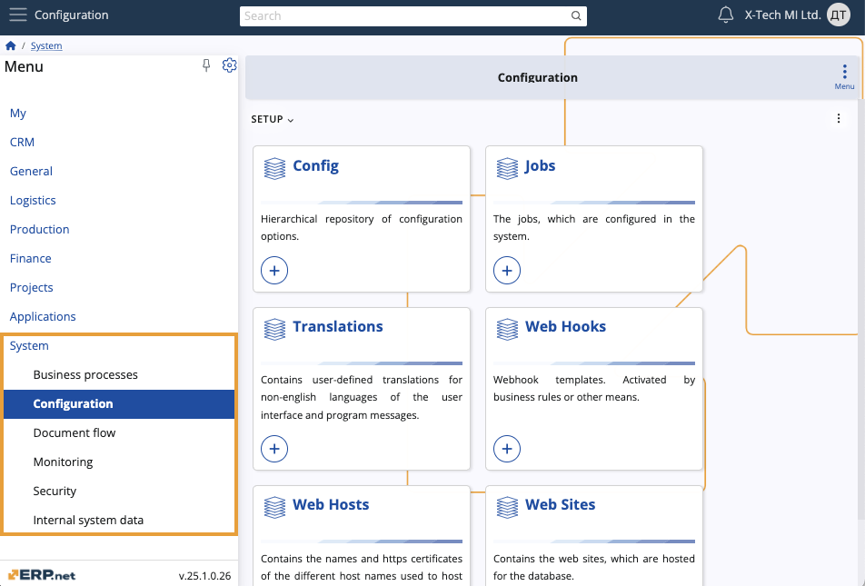

# System

The **System** module forms the foundational infrastructure of ERP.net, facilitating functions such as data management, security configuration, process monitoring, and business automation. It enables efficient customization, secure access control, and integration with external systems, ensuring operational support and regulatory compliance.

## Business Processes

**Business Processes** automates and visualizes business workflows through user-defined rules, calculated attributes, and property management. It supports process optimization and ensures seamless operational efficiency with detailed process diagrams.

## Configuration

**Configuration** centralizes the setup and management of system-wide options, jobs, translations, and web integrations. It provides the tools to customize and optimize system behaviour and performance according to organizational needs.

## Document Flow

**Document Flow** handles the management and customization of document-related processes, including roles, print layouts, and types. It supports efficient document transactions and workflow management through configurable data sources and numbering sequences.

## Monitoring

**Monitoring** tracks and manages system activities, audit logs, and performance metrics. It offers dynamic views and definitions to ensure operational efficiency, compliance, and real-time system health monitoring.

## Security

**[**Security**](security/index.md)** provides robust mechanisms for managing user access, permissions, and roles, ensuring data protection and secure integration with external applications. It includes tools for setting up user domains, groups, and system-wide permissions.

## Internal System Data

**Internal System Data** manages and tracks the essential data elements and configurations within the system. It ensures data consistency, version control, and comprehensive auditing for robust data management.
