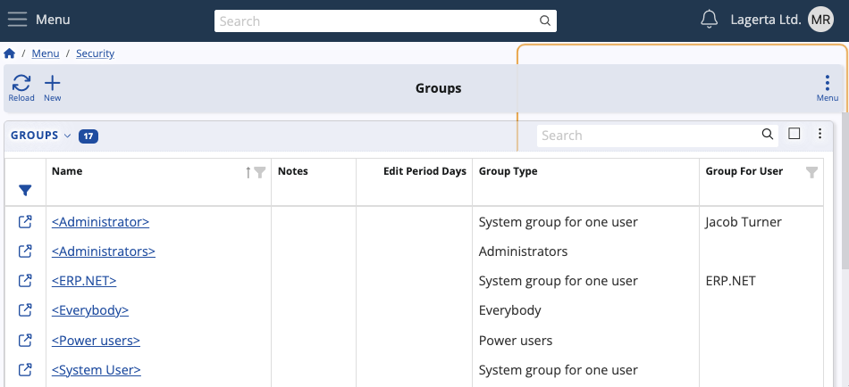

# Groups

Groups are designed to provide predefined level of access to secure data for specific users. 

This is integral to ensuring the appropriate allocation of responsibilities within the platform.

## Group types

Any custom groups can be created freely. However, there are only a few **types** that can be assigned to them:

1. **Normal user-definable group**

   Default type with limited access to the platform.

2. **System group for one user** _(cannot be modified as it is system-defined)_

   Full access to the platform and its features. Exclusive to one user.

3. **Administrators** _(cannot be modified as it is system-defined)_

   Full access to the platform and its features.
   
4. **Everybody** _(cannot be modified as it is system-defined)_

   General access to the platform without limitations to user participation.

5. **[Power users](power-users.md)**

   Expanded access that offers more than a user-definable group but less than one for administrators.
