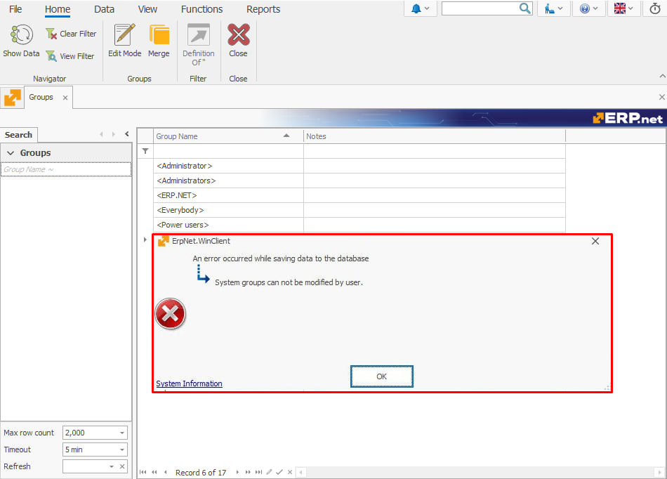

# Power Users

**Power Users** is a system-defined **[group type](index.md#group-types)** providing select users with privileges elevated above those of the **Normal user-definable group** type but below the **Administrators** type. Its primary purpose is to allow users to access permissions via the **Security (Access Permissions)** panel, as well as have the option to make this panel visible or hidden for regular users.

### System Data

- **[GroupType Value](https://docs.erp.net/model/entities/Systems.Security.Groups.html#grouptype):** `P`
- **Description:** PowerUsers
- **Database Value:** `P`
- **Model Value:** 4

## Key features

The Power Users group:

1. Grants access to the **Security (Access Permissions)** panel and allows Power Users to make it accessible/hidden for regular users.

2. Has users always **manually added**. Unlike in the **Administrators** group type, there is no checkbox or automated assignment process.

3. **Cannot** be edited directly by users. This includes changing its name and header.

   Any attempt by users to modify it will result in an **error**, ensured by **[business rule R37166](https://docs.erp.net/tech/modules/system/security/system-permissions/manage-access-permissions.html?q=R37166#business-rule-enforcement)**.

   
   
