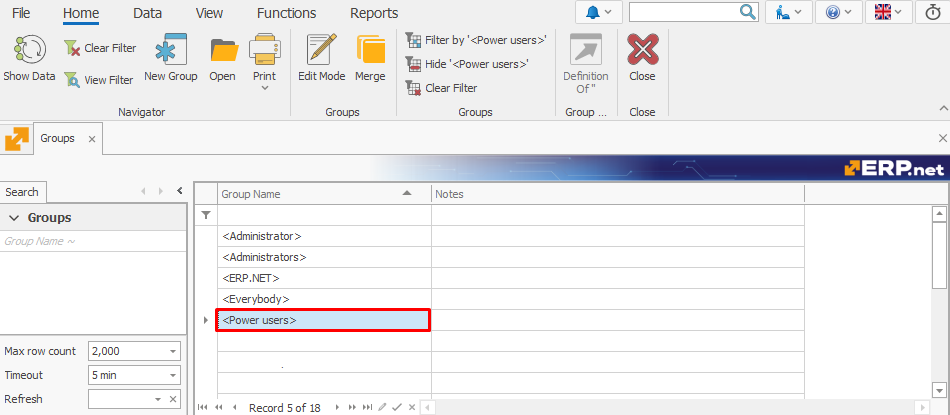

# Power Users

**Power Users** is a system-defined **[group type](index.md#group-types)** that serves as an intermediate tier between administrators and regular users. It offers elevated permissions without granting full administrative privileges.

The Power Users group can manage access rights via the **Security panel** (Desktop) and **Access Permissions panel** (Web), which are hidden by default for regular users. This reduces Power Users' dependency on administrators for certain security tasks.

### System Data

- **[GroupType Value](https://docs.erp.net/model/entities/Systems.Security.Groups.html#grouptype):** `P`
- **Description:** PowerUsers
- **Database Value:** `P`
- **Model Value:** 4

> [!NOTE]
> Together with the Administrators group, the Power Users group is assigned the **[Manage Access Permissions key](../system-permissions/manage-access-permissions.md)**, which enables it to view and interact with the Security/Access permissions panel.

## Key features

1. Members are always **manually added** to the Power Users group. Unlike in the **Administrators** group type, there is no checkbox or automated assignment process.

2. The Power Users group **cannot** be edited directly by users. This includes changing its name and header.

   Any attempt by users to modify it will result in an **error**, handled by **[business rule R37166](https://docs.erp.net/tech/modules/system/security/system-permissions/manage-access-permissions.html?q=R37166#business-rule-enforcement)**.

   
   
