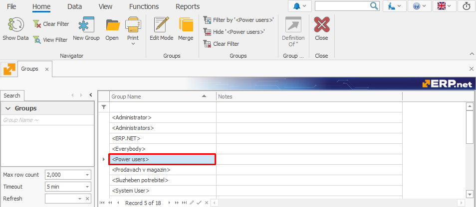
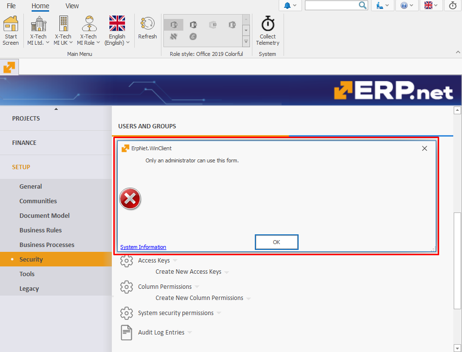

# Power Users

**Power Users** is a system-defined **[group type](index.md#group-types)** providing select users with privileges elevated above those of the **Normal user-definable group** type but below the **Administrators** type. Its primary purpose is to allow users to access the **Access Permissions** panel of the **Security** section, as well as have the option to make this panel visible or hidden for normal users.

## Key features

1. Users are always **manually** added to the Power users group.

   Unlike the **Administrators** group type, there is no checkbox or automated assignment process.

2. Power users is a **system** group type and **cannot** be edited directly by users.

   Any attempt by users to modify it will result in an **error**, ensured by **[business rule R37166](https://docs.erp.net/tech/modules/system/security/system-permissions/manage-access-permissions.html?q=R37166#business-rule-enforcement)**.

   

## System Data

- **[GroupType Value](https://docs.erp.net/model/entities/Systems.Security.Groups.html#grouptype):** `P`
- **Description:** PowerUsers
- **Database Value:** `P`
- **Model Value:** 4
