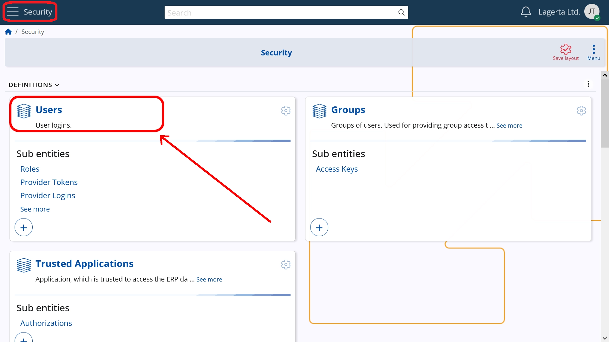
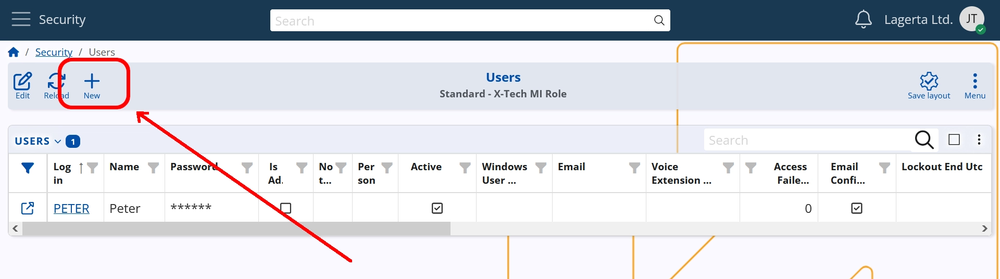
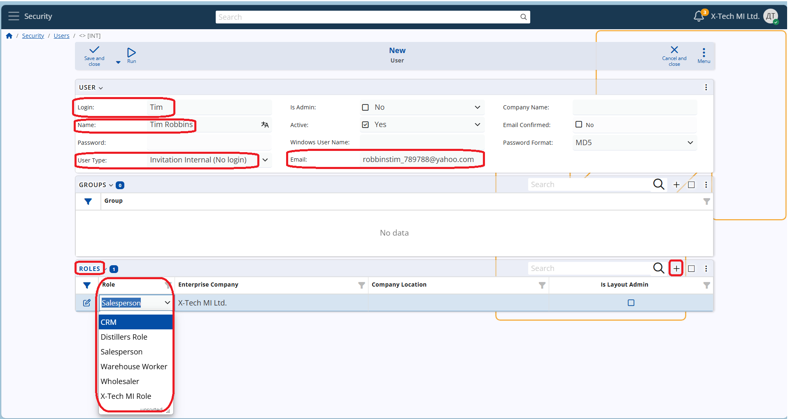
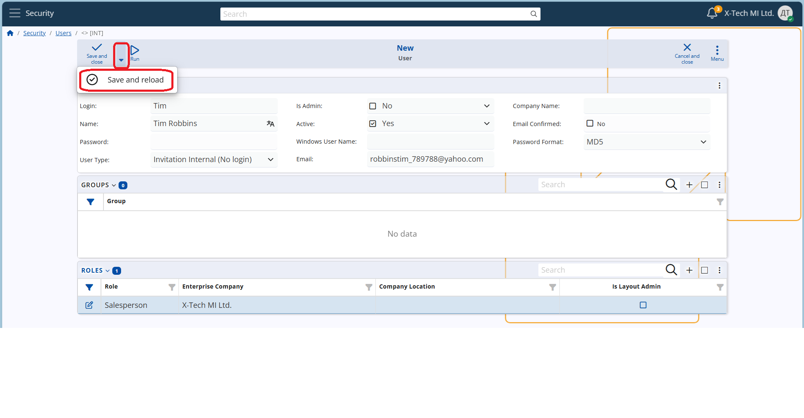
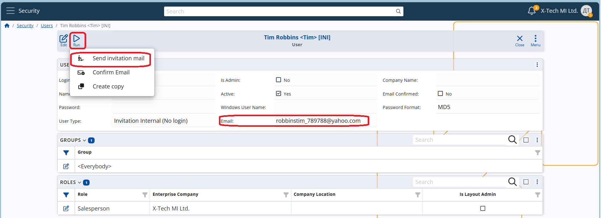
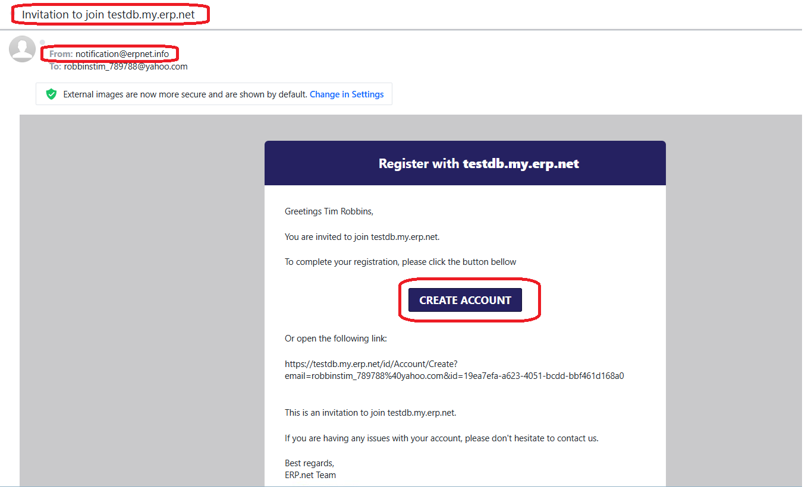
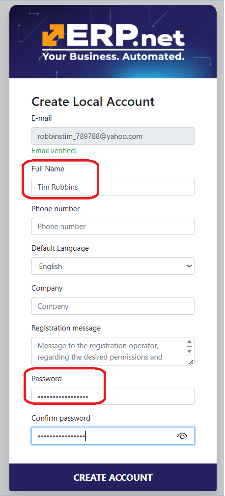
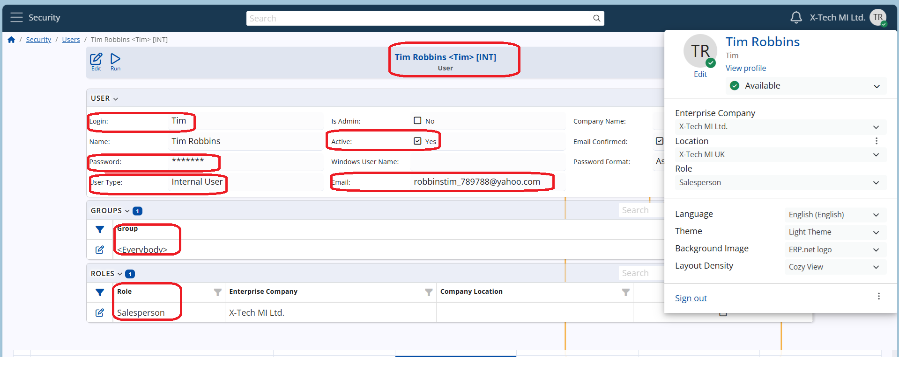

# How to invite a user to a WEB instance

To create an account for a new user, an **email invitation** must be sent to this user from an administrator.  
The process involves two participants – the **administrator** of the instance and the **new user**.

## Administrator Steps

First the administrator must create a new user in the system:

**1.** Go to the **Security** module and open navigator **"Users"**.
>


**2.** On the header line (the horizontal grey line), find the **“plus”** button and click on it.  
>

This will open a form that you should fill in. 

**3.** Fill in several required fields:
   - **Login** – the login name of the user
   - **Name** – the name of the user
   - **Email** – a valid email address, to receive the invitation
   - **User Type** – this is a very important field at this point.  
     Clicking on it will open a dropdown menu. You must choose:  
     ```text
     Invitation Internal (No login)
     ```

**4.** Assign a role for the new user – you can do it now or at a later stage.  
   This is done in the **"Roles"** panel.  
   Find the **“plus”** icon on the right side and add a new line in the panel.  
   In column **"Role"**, choose an available role (e.g. Salesperson, Manager, Worker, etc.).  
   You can assign several roles per user.
   
  > 

**5.** Save the new user by clicking the arrow next to "Save" using option "Save and reload"
   
> 
   
   At this stage, a new user is created and saved in the platform, He is assigned to the **group** "Everybody".
   
   It is time to **send the invitation**.

**6.** On the header line, click **“Run”**.

**7.** Choose the option:  
   ```text
   Send invitation mail
   ```  
> 
The system will ask for confirmation. Confirm by clicking OK. This sends an email to the user.

## User Steps

**8.** The user will receive an email **from**: notification@erpnet.info,  **Subject:**   Invitation to join {InstanceName.my.erp.net}
> 
   
**9.** The user must click the **Create Account** link and will be transferred to a form.  
> In the form, **email** is elready filled.
> Enter user's name.
> Create an **8-character password** and **confirm**.

> 


**10.** The user can now log into the platform using the given login and the newly set password.

**11.** The **User Type** will automatically change to "Internal" 

> 
  
> [!NOTE] 
If a role has not been assigned, after login the user might encounter this error:
> 
> _"The currently logged user {UserName} has no assigned roles.
> Please contact your system administrator to configure the roles for user {UserName}._

In this case, the user should contact the administrator for assistance.
   
