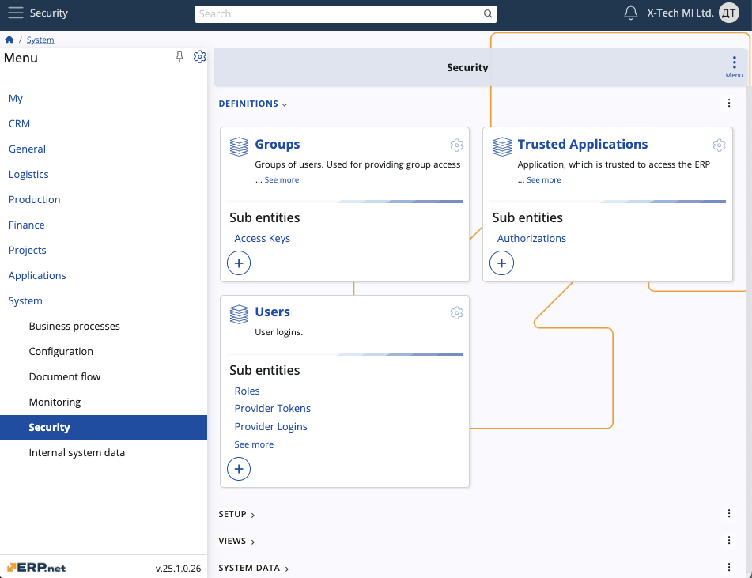

# Security 

The **Security** section focuses on managing access controls and permissions within the system to safeguard sensitive data and ensure adequate user interactions. It  plays a crucial role in maintaining the integrity and confidentiality of ERP.net system data and operations.

It offers features such as defining user roles, configuring system permissions, managing access keys for data security, and controlling the visibility of UI elements based on roles and preferences. 

## Definitions 

- **Groups**
  - Groups of users providing collective access to secured data, facilitating efficient permission management.

- **Trusted Applications**
  - Applications trusted to access ERP.net data securely, ensuring controlled integration with external systems.

- **Users**
  - User logins managing access and roles within the system, ensuring authenticated user interaction.

## Setup 

- **Domains**
  - Represents user domains with distinct email configurations, organising users into separate administrative units.

- **Entities**
  - Contains entities with secured access, defining access permissions for specific data entities.

- **Roles**
  - Various roles defining user permissions and capabilities, managing user access based on predefined roles.

## Views

- **System Permissions**
  - Controls access to different parts of the software based on predefined permissions, ensuring data and system security.

## System Data

- **Access Keys**
  - Provides a basic locking mechanism for data security by assigning access keys to records, managing data access through user groups.

- **Column Permissions**
  - Manages user permissions for accessing specific system data columns, ensuring controlled data visibility.

- **External Applications**
  - Lists external applications authorised to run operations, facilitating integration and external system management.

- **Visual Permissions**
  - Manages permissions for client applications to show/hide UI elements based on user roles and preferences.
