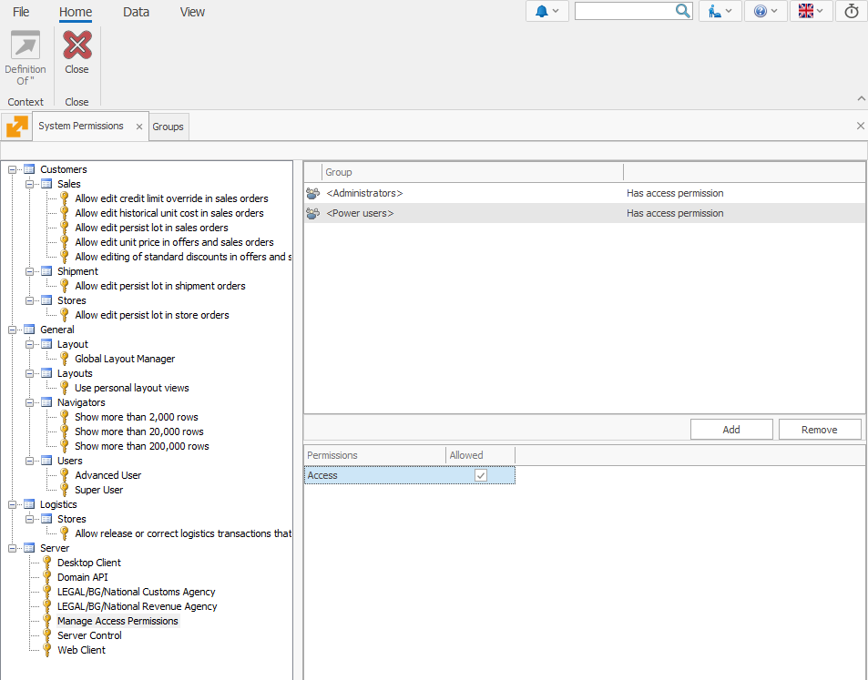

# System Permissions

The **System Permissions** panel is a central hub for managing user access to various functionalities across the platform. 

Administrators can grant or restrict permissions by assigning specific **system keys** to security groups. These keys define what actions users can perform and which sections they can access. 

Each security group can have its own set of specific permissions. If a system key is **not** assigned to any group, **all users** automatically have access to it.

For instance, the visibility of the **Security panel** (Desktop) and the **Access Permissions panel** (Web) is controlled by the **[Manage Access Permissions key](manage-access-permissions.md)**.

