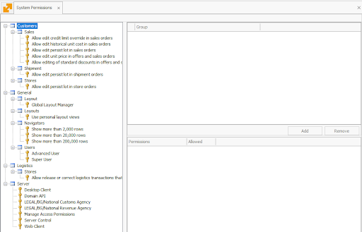

# **System Permissions**

The **System Permissions** panel is a central hub for managing user access to various functionalities across the platform. 

It allows administrators to grant or restrict permissions by assigning specific keys to groups or individual users.

---

The System Permissions panel enables precise control over user access through permission keys. 

These keys define what actions users can perform and which sections they can access. 

---

Below is a brief description of key functionalities:

- **Permission Assignment:** Administrators can assign or revoke specific permission keys for groups or individual users.
- **Role-Based Access:** Keys can be applied to predefined groups, such as Administrators, Power Users, and Normal Users.
- **Visibility Control:** Keys determine whether users can access certain panels, including Security and Access Permissions.

