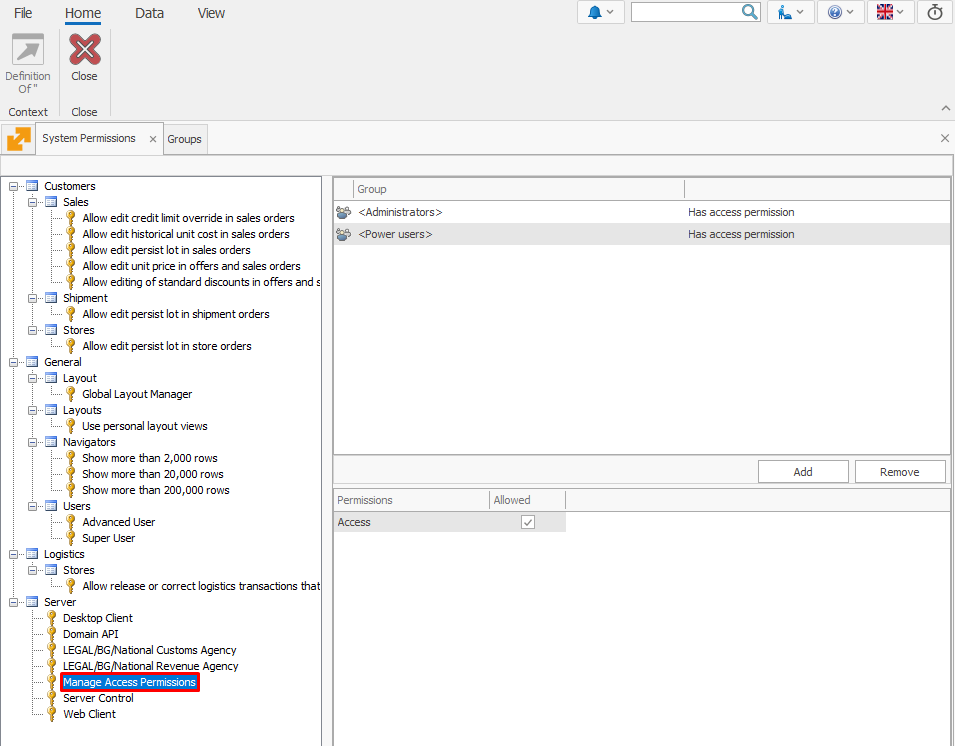

# **Manage Access Permissions**

The **Manage Access Permissions** key provides select users and **[groups](../groups/index.md)** access to the **Security** (Desktop) and **Access Permissions** (Web) panel. Only users and groups assigned this key are able to see and access these panels in their respective environments.

### System data

- **Name:** Manage Access Permissions
- **Description:** Allows users to manage access rights for other users.
- **Default Groups:**
  
  - **Administrators**
  - **[Power Users](../groups/power-users.md)**

## Key features

The Manage Access Permissions key:

- Allows the **[Power Users](../groups/power-users.md)** and **Administrators** groups to see and access the **Security/Access Permissions** panel.
  
- **Restricts** visibility to this panel for users/groups not having the key.
