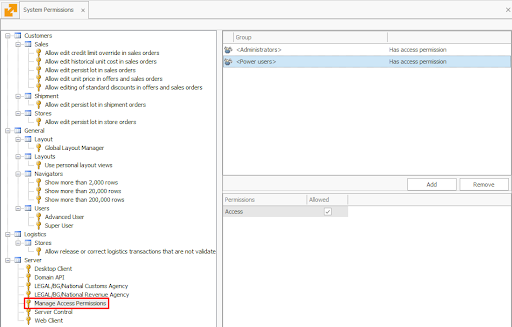
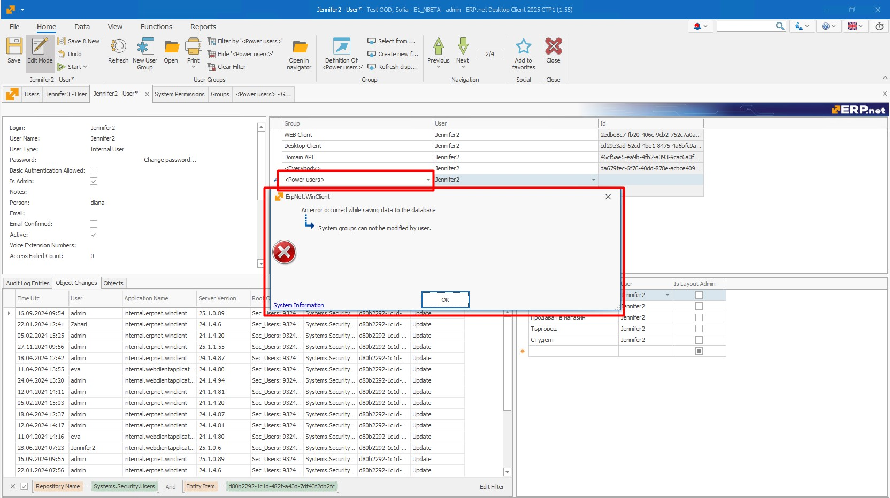

# ** Manage Access Permissions**

The **Manage Access Permissions** key is designed to provide select users or groups access to the **Security** panel (in the Desktop Client) or the **Access Permissions** panel (in the Web Client). 

Only users with this key will see these panels in their respective environments.

## **Key Details**
- **Key Name:** Manage Access Permissions
- **Key Description:** Allows users to manage access rights for other users.
- **Default Groups:**
  - Administrators
  - Power Users

> **Note:** If a group does not have this key, its members will not see the Security/Access Permissions panels.

## **Business Rule Enforcement**
A new business rule ensures proper implementation:
- **Rule Name:** R37166 SecurityGroup – System Group Update Not Allowed
- **Functionality:** Prevents unauthorized modifications to the Power Users and Administrators groups, which are automatically assigned this key.

---

## **Implementation Details**

### **Database Changes**
A new permission key is added to the database with the following configuration:

| Attribute        | Value                            |
|------------------|----------------------------------|
| Key              | ManageAccessPermissions         |
| Description      | Manage Access Permissions       |
| Default Groups   | Administrators, Power Users     |

### **User Interface**
- The **Manage Access Permissions** key appears in the System Permissions dropdown menu.
- Users with this key can access the **Security/Access Permissions** panels seamlessly.
- Visibility is hidden for users without this key.

---

The **Manage Access Permissions** key enhances the platform’s role-based access control by delegating permission management to designated groups without compromising security. 

By default, this key is assigned to the **Administrators** and **Power Users** groups, ensuring that users in these roles have the necessary access to manage permissions efficiently.
