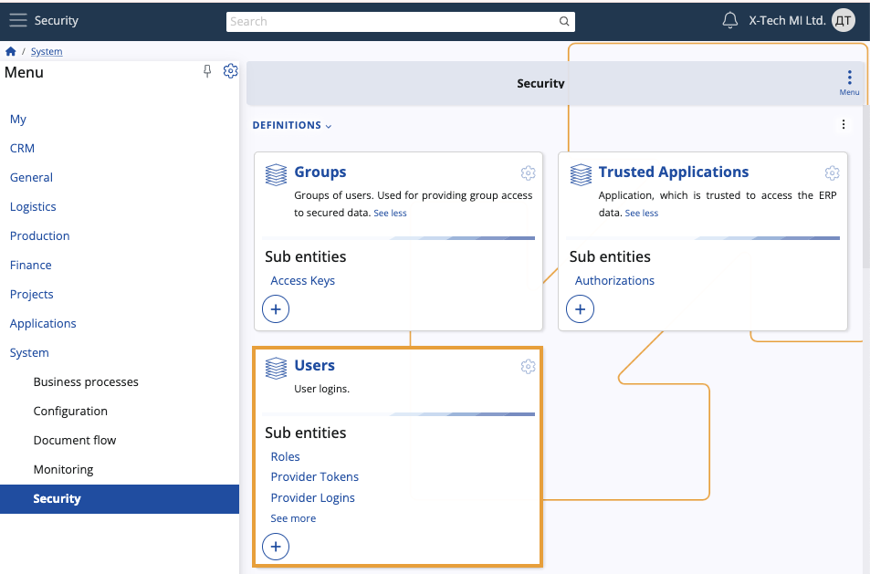
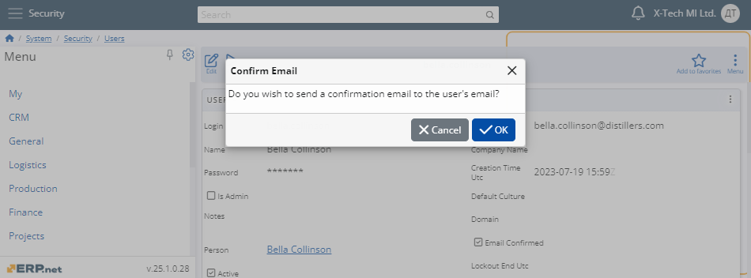
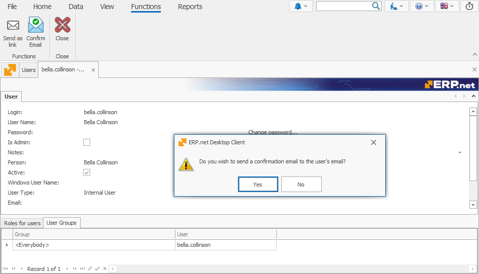
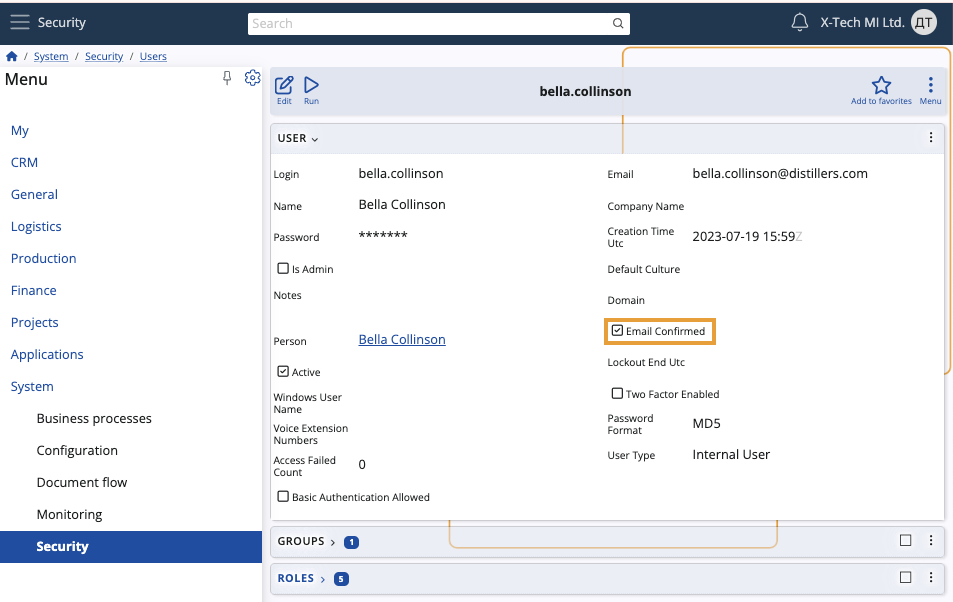
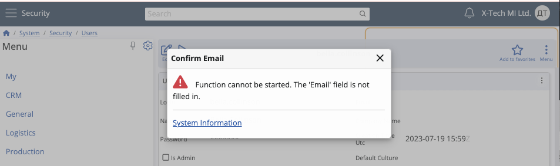
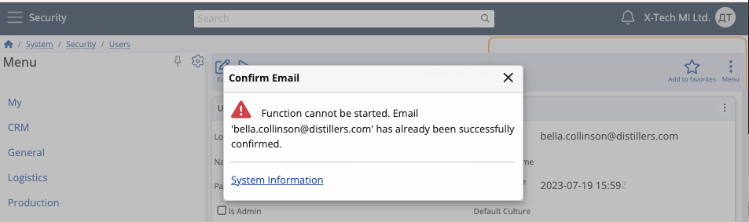

# Confirm Email

The **Confirm Email** function allows administrators to quickly send a confirmation request to the email address specified in a user's profile.

It streamlines the overall email verification process by saving time and ensuring that a provided address is fully authentic.

> [!IMPORTANT]
> The function will **not** work if:
> 
> * you're in **Edit mode** for the user profile; in this case, it will be greyed out
> * the **Email** field of the user is **empty**; in this case, it will result in an error 
> * the email of the user is **already confirmed**; in this case, it will result in an error.

## Using the function in the ERP.net Web Client

Below is a step-by-step guide for using the **Confirm Email** function in the @@name Web Client.

1. Navigate to the **Users** panel and open the user whose email you want to confirm.

   Make sure this email is specified in their **Email** field.
  
   

2. To trigger the function, click the **Run** button and select **Confirm Email**.

   This will **not** be possible if you enter Edit mode for the user.
  
   

3. A pop-up will appear asking whether you want to send the confirmation email.

   Click **OK** to proceed. 
  
   

   The user should receive their confirmation request provided that their email address hasn't been already verified.

   Inside, the message will look like this:   

   _"Hi [User Name],_

   _We have received a request to update your email address. Please confirm this change by following this link below:_

   _[Link]_

   _Thank you for your cooperation. If you did not initiate this process, please contact the system administrator for assistance."_   

> [!NOTE]
> Upon clicking their verification link, a user will be taken to a one-time login form where they need to enter their credentials in order to access their profile. Inside, they can confirm their email address by either changing it or keeping the one they've provided.
   
## Using the function in the ERP.net Desktop Client

The **Confirm Email** function can also be executed in the @@name Desktop Client.

1. Navigate to the **Users** navigator and open the user whose email you want to confirm.
  
   
  
2. Navigate to the **Functions** tab and click on the **Confirm Email** function.
  
   

3. A pop-up will appear asking whether you want to send the confirmation email.

   Click **OK** to proceed.
  
   

   The user should receive their confirmation request provided that their email address hasn't been already verified.

## Email Confirmed status

Starting from ERP.net version 25, upon successful completion of the email confirmation process, the **Email Confirmed** field in the definition of the user will be automatically set to "True" (as represented by a check mark in a box).

This field **cannot** be modified in any way, unless the **Email** of the user is changed or deleted.

In that case, a new confirmation process will be necessary for the email to be verified. 

If the process is successful, the **Email Confirmed** field of the respective user will be set to "True" once again.

> [!NOTE]
> This feature will be available from version 25 onward. Your current platform instance may not support it yet.

## Error messages

The **Confirm Email** function will be prevented from executing and will throw an error message in the following scenarios:

1. The **Email** field of the user is not filled:

   _"Function cannot be started. The 'Email' field is not filled in."_

   

2. The email of the user is **already confirmed**:

   _"Function cannot be started. Email {User.Email} has already been successfully confirmed."_

      

> [!NOTE]
> 
> The screenshots taken for this article are from v24 of the platform.
