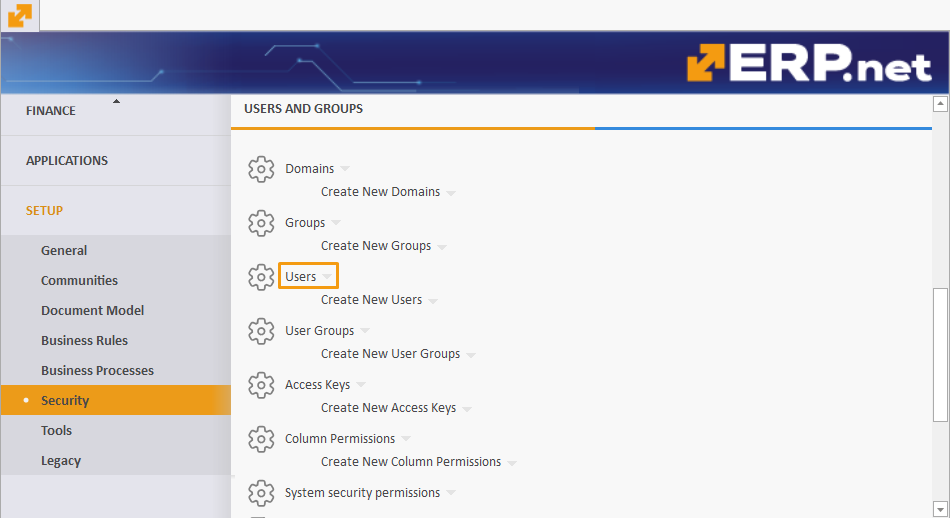
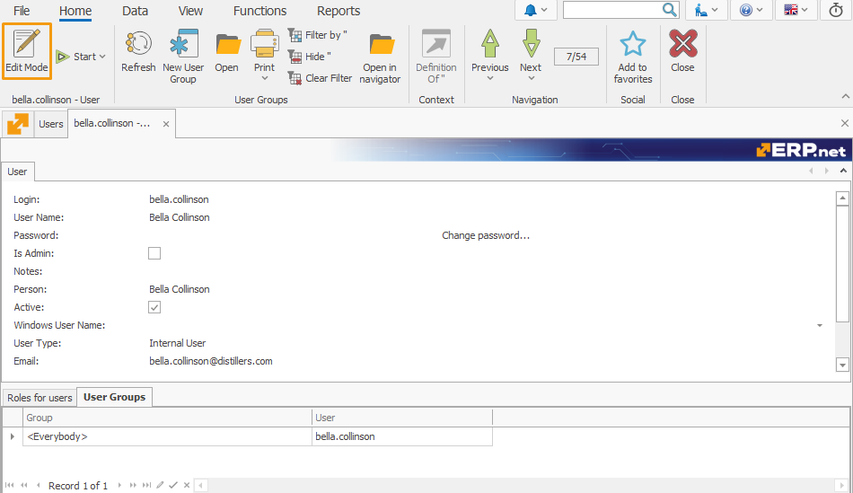
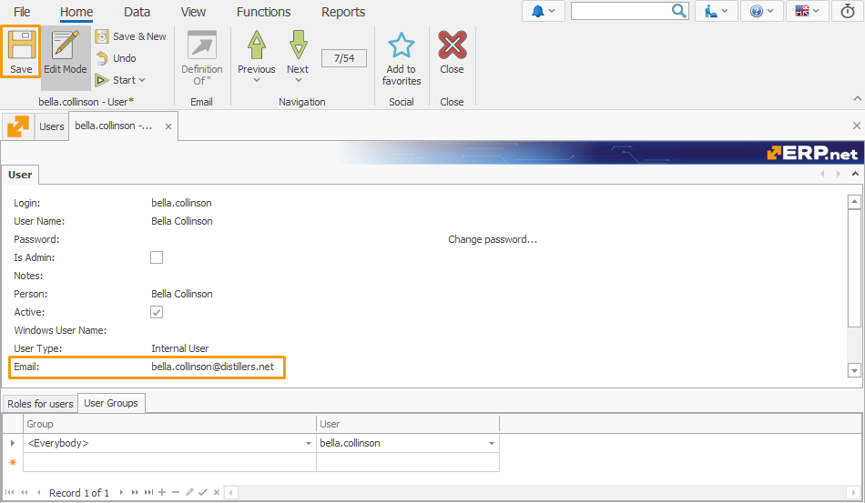
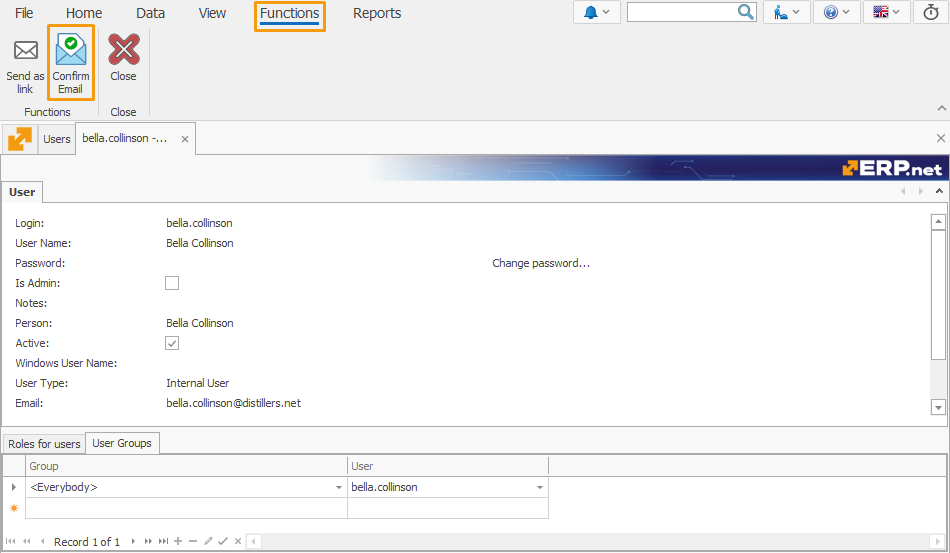
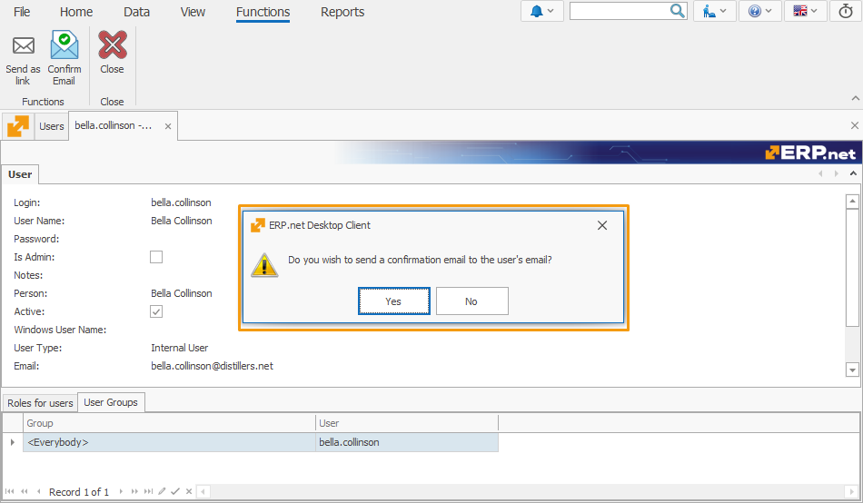
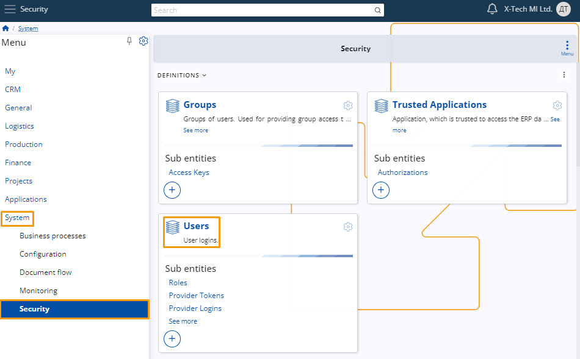
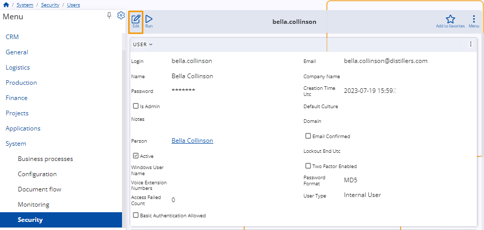
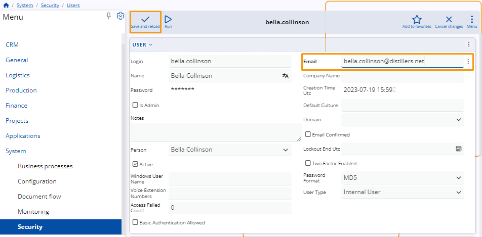
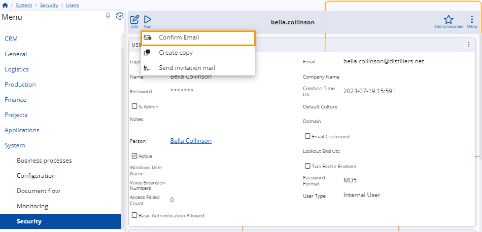
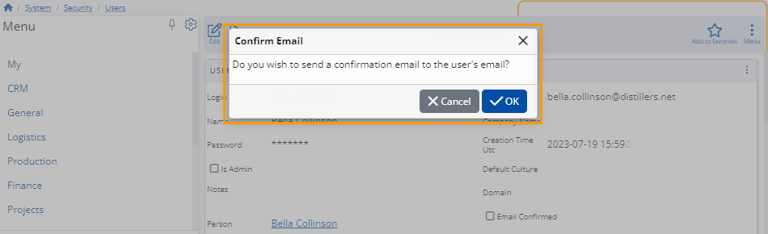

# Confirm Email

The **Confirm Email** feature in ERP.net allows administrators to send email verification requests easily. 

This feature enhances security and ensures that users' email addresses are verified correctly. 

By following these steps, you can efficiently manage email confirmations for users within both the desktop and web clients.

## Using the Desktop Client

1. **Log In**

  Log in to the system using your **administrator credentials**.

2. **Navigate to User Settings**

  Go to **Setup** > **Security** > **Users** and select the user you want to edit.
  


3. **Enter Edit Mode**

  Click on the user to open their details, then enter the **edit mode** by clicking the **Edit** button.
  


4. **Update Email**

  In the **User** panel, enter the email address in the **Email** field and **save** the changes.
  


5. **Access Confirm Email Function**

  Navigate to the **Functions** tab and click the **Confirm Email** button.
  


6. **Confirm Email Dialog**

  A dialog box will appear asking: **Do you wish to send a confirmation email to the user's email?** Click **OK** to send the verification email.
  


## Using the Web Client

1. **Log In**

  Log in to the system using your **administrator credentials**.

2. **Navigate to User Settings**
  
  Go to **System** > **Security** > **Users** and select the user you want to edit.
  


3. **Enter Edit Mode**

  Click on the user to open their details, then enter the **edit mode** by clicking the **Edit** button.
  


4. **Update Email**

  In the **User** panel, enter the email address in the **Email** field and **save** the changes.
  


5. **Access Confirm Email Function**

  Click the **Run** button and select **Confirm Email** from the list.
  


6. **Confirm Email Dialog**

  A dialog box will appear asking: **Do you wish to send a confirmation email to the user's email?** Click **OK** to send the verification email.
  


## Error Handling

1. **Email Field Empty**

  If the **Email** field is not filled, you will receive an error message:
  - "Function cannot be started. The 'Email' field is not filled in."

2. **Email Already Confirmed**

  If the email is already confirmed, you will receive an error message:
  - "Function cannot be started. Email {User.Email} has already been successfully confirmed."

## Confirmation Email Content

When you confirm, the user will receive an email with the following content:

  ```
  Hi [User Name],
  We have received a request to update your email address. Please confirm this change by following this link below:
  [Link]
  Thank you for your cooperation. If you did not initiate this process, please contact the system administrator for assistance.
  ```

> [!NOTE]
>
> Starting from version 25, upon successful completion of the email validation process, the user's "Email Confirmed" status will automatically be set to True in ERP.net.

> [!NOTE]
> 
> The screenshots taken for this article are from v24 of the platform.
