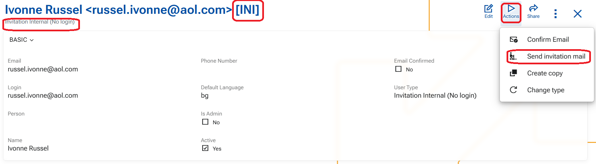

# Send invitation mail

The **Send invitation mail** function sends an email invitation to the address specified in the user’s profile. It is used to allow a new user of type Invitation (Internal or External) to register an account and gain access to the ERP.net instance.

The registration is partially done by now (the creation of the user into the instance), and now the user needs to set his password and fill his name and other relevant information if needed, directly into the registration form.

The recipient follows the link in the email to create or activate their account. Therefore, the user’s email address must be valid before sending the invitation.

For more information, see [How to invite a user to a WEB instance](https://docs.erp.net/tech/modules/system/security/how-to/invite-a-user.html).

1. Once the admin creates an invitation user, he should send an invitation to join the instance by mail.
2. From the "Actions" button menu press option "Send invitation mail"

- the system sends an e-mail letter, from sender address " notifications@erpnet.info"
- the title of the letter is "Invitation to join (instancename.my.erp.net)"
- the letter contains a link to finish the registration by setting a password and other relevant information from the users' side

3. Once the user follows the link, a fill-in forms opens.
- in the form that opens only the email address is confirmed and unchangeable
  
4. By filling the form and clicking the final "Create account" button the system automatically changes the type of the user to Internal or External
   

