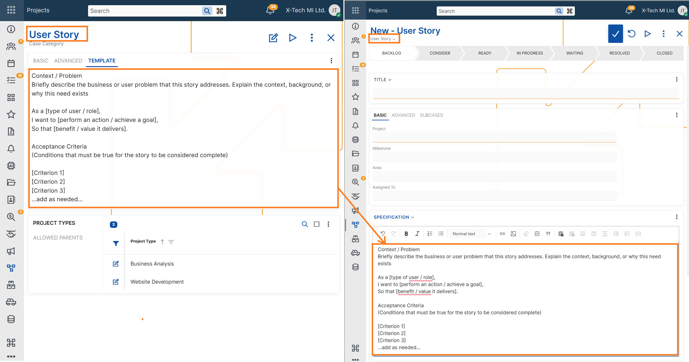

## Specification field in Cases

### Purpose

The **Specification** field defines **what exactly must be implemented in the case**.

It represents the **current agreed definition of the work**. When a case reaches the **READY** status, the Specification must contain a clear and stable description of:

- what functionality will be implemented,
- how the system should behave,
- what conditions determine that the case is completed successfully.

Developers should be able to implement the case based on the Specification.  
Testers should be able to verify the case based on the Specification.

If someone reads only the Specification, they should understand **what the final result must be**, without needing to read the discussion history.

---

## What the Specification must contain

The Specification should describe the **final intended behaviour of the system**.

Typical elements include:

### 1. Functional goal

A short description of the capability the system must provide.

Example:

> The system must allow updating a single column in multiple rows using a paste operation.

---

### 2. Behaviour

A precise description of how the system should behave.

This may include:

- how inputs are processed
- how the system reacts to specific conditions
- how records are matched or modified
- what operations are allowed or restricted

Example:

> Rows are matched by natural key.  
> Only the columns present in the pasted data are updated.  
> Other columns remain unchanged.

---

### 3. Constraints and rules

Important rules or limitations.

These help prevent ambiguity during implementation.

Examples:

- whether new records are allowed
- validation rules
- data restrictions
- side effects or non-effects

Example:

> If a pasted row does not match an existing record, no new record is created.

---

### 4. Acceptance criteria

Acceptance Criteria define **how the result can be verified**.

They must be **clear, observable, and testable**.

Examples:

- If the pasted dataset contains an existing natural key, the corresponding record is updated.
- Only explicitly included columns are modified.
- Records not present in the pasted data remain unchanged.

Acceptance Criteria should allow a tester to determine whether the implementation is correct.

---

## What must NOT be included in the Specification

The Specification must **not** contain information about the reasoning or discussions that led to the decision.

The following content belongs elsewhere (for example in Developments or Chat):

### 1. Rationale

Explanations such as:

- why the feature is needed
- business motivation
- customer requests
- strategic goals

Example of content that should **not** appear in the Specification:

> Users often need to update multiple rows, which currently requires manual editing.

---

### 2. Context

Background information such as:

- product context
- customer situations
- historical notes

---

### 3. Research

Investigation results or exploratory findings.

Examples:

- comparisons of alternative approaches
- early experiments
- prototype descriptions

---

### 4. Rejected alternatives

Descriptions of solutions that were considered but not chosen.

Example:

> Another option was to add a bulk edit dialog, but this approach was rejected.

This type of information belongs in **Developments**, not in the Specification.

---

## Specification vs Developments vs Chat

Each section of a case has a different role.

### Specification

Defines **the current agreed behaviour to implement**.

It is **edited and refined over time**, but at any moment it should represent the current decision.

---

### Developments

Contain the **history of the case evolution**.

Typical content includes:

- design proposals
- decisions and revisions
- investigation notes
- rationale for changes

Developments are append-only and represent the **decision timeline**.

---

### Chat

Contains **discussion and informal communication**.

Typical content includes:

- questions
- clarifications
- brainstorming
- quick exchanges between participants

Chat messages are not authoritative and should not define the final solution.

---

## When the Specification must be complete

The Specification must be sufficiently complete when the case reaches:

**READY**

At this point:

- the intended behaviour must be clearly defined
- implementation should not require further conceptual decisions
- developers should be able to start work without needing to interpret discussions.

Minor clarifications may still occur later, but the core functionality must already be defined.

---

## Writing guidelines

To keep Specifications clear and useful:

- describe **observable behaviour**
- avoid long explanations
- avoid historical context
- focus on **what the system must do**
- write in clear, precise statements

A good rule is:

> If a tester can verify the feature using the Specification alone, the Specification is correct.

---

## Specification templates

When creating a new Case, the **Specification** field may be automatically populated with a predefined **template**, depending on the configuration of the selected Case Category.

This template is meant to guide users in providing a structured, consistent, and clear specification of the Case. It may include:

- Placeholder phrases (e.g., "As a [user], I want to [action], so that [goal]")
- Formatting guidelines
- [System variables](/advanced/string-interpolation/system-variables.md)

Users are free to edit or replace the template content before saving the Case.

*For setup details, see [Case Categories –> Advanced settings –> Specification Template](../configuration-and-structure/main-setup/case-categories.md#description-template)*

---

## Summary

The Specification is the **authoritative definition of the work to be implemented**.

It should contain:

- the functional goal
- system behaviour
- rules and constraints
- acceptance criteria

It should **not contain**:

- motivation
- background
- investigation
- discussion
- rejected alternatives

Those belong in Developments or Chat.

The Specification defines **what must be built and what must be verified**.
