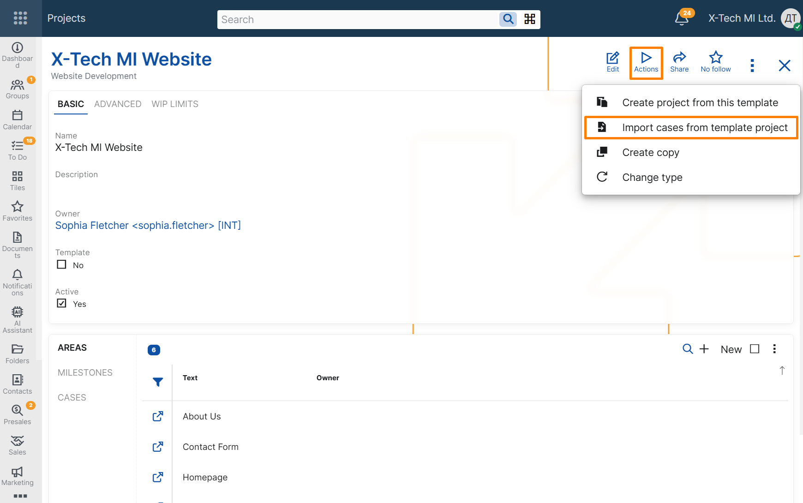

# Import cases from template project

## Overview

The **Import cases from template project** UI function allows users to import Cases from a template Project into an existing Project.

This function is intended for recurring work that follows a standard case structure. Instead of creating the initial Cases manually, users can import them from a template Project and reuse an already prepared set of work items.

When the function is executed, the system creates new Cases in the target Project based on the Cases from the selected template Project.

This helps teams reuse standard project content, reduce manual setup, and prepare a new backlog more quickly.

## Availability

The function is available from the **Action** button in two places:

- in the form of a single Project record;
- in the **Projects** navigator, when a Project record is selected.

The function can be started for any Project from the UI. During execution, the user must select a template Project to import from.

If no template Project is selected, the function cannot be executed.

The function is disabled while the Project is in edit mode.

## Case data in the target Project

The function creates new Cases in the target Project based on the Cases in the selected template Project.

The new Cases preserve the main planning structure of the template Cases, including:

- **Title**
- **Project Area**
- **Project Milestone**
- **Case Category**
- **Specification**
- **Estimated Time Hours**
- **Story Points**
- **Owner User**
- **Social Group**

At the same time, the imported Cases are initialized as new work items in the target Project. The following execution-specific data is reset:

- **System State** is set to **Backlog**;
- **Assigned To User** is cleared;
- **User State** is cleared;
- **Sprint** is cleared;
- **Parent** is cleared;
- **Duplicate Of Case** is cleared;
- **Stakeholder Party** is cleared;
- workflow timestamps from the original Cases are not copied;
- a new creation time is assigned.

This behavior allows the target Project to reuse the structure and planning data of the template without copying execution history from previous work.
