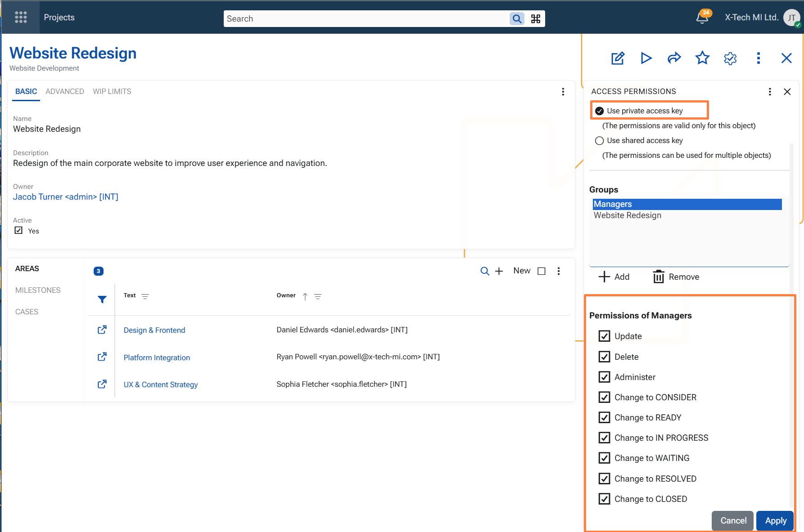
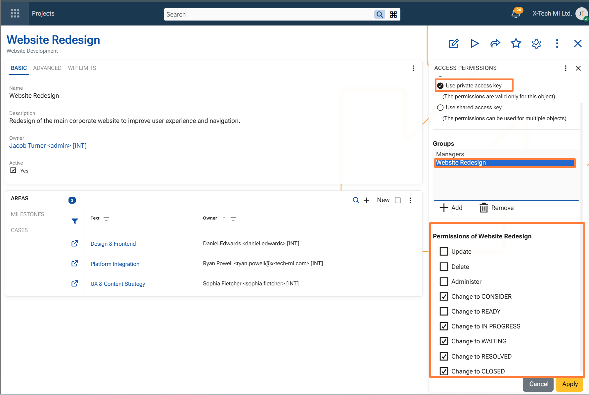
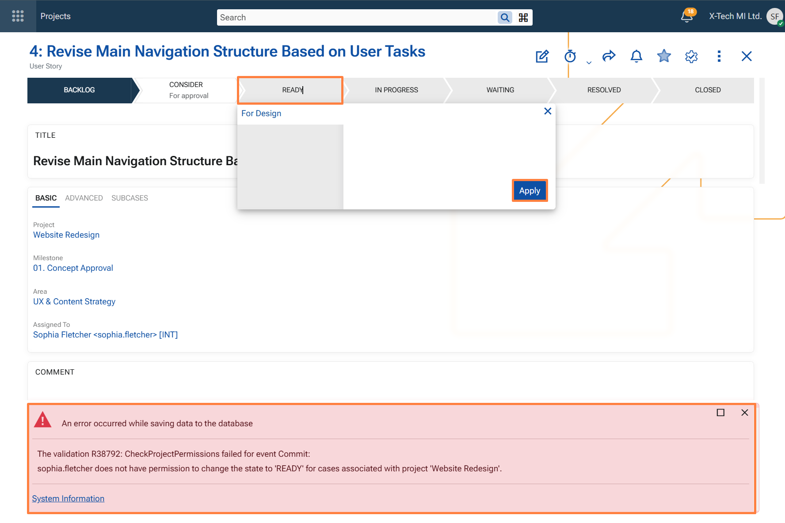

## Security

### Project-based access control

To enhance confidentiality and governance in **Agile PM**, @@name introduces project-level access control using Access Keys. This security model ensures that only authorized users and teams can view or act on Cases associated with sensitive projects.

Access permissions are defined centrally within the **Access Permissions** panel of each Project and include:

- **Basic permissions:**
  - **Update** – modify the project or its related Cases
  - **Delete** – remove the project
  - **Administer** – full control over the project security settings

- **Extended permissions** (specific to Agile PM Cases):
  - **Change to CONSIDER**
  - **Change to READY**
  - **Change to IN PROGRESS**
  - **Change to WAITING**
  - **Change to RESOLVED**
  - **Change to CLOSED**

These extended permissions regulate **state transitions** for Cases under the project.  
For example, if a user only has the "Change to READY" right for a project, they can only move Cases into that state — and not others.

> [!Note]
> These permissions are automatically inherited by all Cases linked to the project.

When a user attempts an unauthorized state change, they receive a clear error message indicating the lack of permission to perform that specific transition for the project’s Cases.

### Visibility filtering

To prevent unauthorized access to sensitive Cases, the system applies secure filtering at the data level:

- In the **Cases navigator**, users only see Cases linked to Projects for which they have access rights.
- In the **Global Search**, Cases outside the user's access scope are excluded from the results.

This ensures that users can only discover and interact with project information that aligns with their granted permissions, reinforcing data confidentiality across the **Agile PM** module.

### Example: Access and visibility for a private project

The following example shows how project-based access control and visibility filtering work together for a project secured with a private access key.

A project named **Website Redesign** is configured with a **private access key**. Access to this key is granted to two groups:

- **Managers**
- **Website Redesign**

Because both groups are granted access to the project's private access key, their members can access the project and the Cases associated with it.
Users who are not granted access to that key cannot access the project and cannot see the related Cases in the **Cases navigator** or in **Global Search**.

**Permissions granted to the Managers group**

- **Update**
- **Delete**
- **Administer**
- **Change to CONSIDER**
- **Change to READY**
- **Change to IN PROGRESS**
- **Change to WAITING**
- **Change to RESOLVED**
- **Change to CLOSED**

This means that members of the **Managers** group have full control over the project and can perform all configured Case state transitions.

**Permissions granted to the Website Redesign group**

The **Website Redesign** group is also granted access to the same private access key, but with a different permission set.

Its members can change the state of Cases associated with the project to the following states:

- **CONSIDER**
- **IN PROGRESS**
- **WAITING**
- **RESOLVED**
- **CLOSED**

However, they are not allowed to:

- **Update** the project
- **Delete** the project
- **Administer** the project's security settings
- change a Case to **READY**

**Effective permissions for specific users**

This configuration affects users according to the groups they belong to.

- **Jacob Turner** is a member of the **Managers** group. As a result, he can maintain the project and perform all allowed Case state transitions in this example.

- **Sophia Fletcher** is a member of the **Website Redesign** group. She can open the project and work with its Cases according to the permissions granted to that group, but she cannot update the project, delete it, administer its security settings, or move a Case to **READY**.

**Visibility and blocked state transition**

Because **Sophia Fletcher** has access to the private access key of the **Website Redesign** project, she can open the project and see the Cases associated with it.

If she attempts to change a Case related to that project to **READY**, the operation is rejected because her group has not been granted permission for that specific transition.

The system displays an error indicating that the user does not have permission to change the Case to the **READY** state for the selected project.

