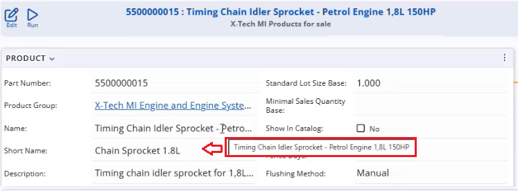
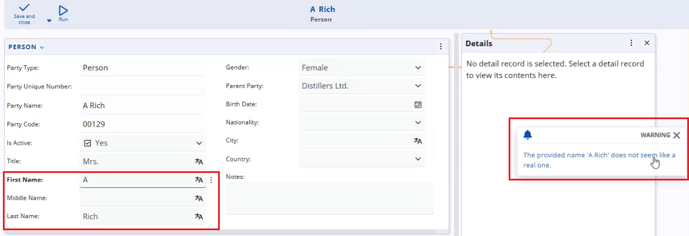

# AI Business Rules

**AI Business Rules** allow @@name to call the configured AI model directly from User Business Rules.  

Using natural-language prompts, you can **delegate tasks that are difficult or expensive to express with classic formulas** — such as generating meaningful short names for products, validating IBANs, or checking whether a party name “looks real” — and plug them into your existing business logic. 

**Three specialized AI action types are available**:

- **[AISET](/advanced/user-business-rules/action-types/aiset.md)** – uses an AI prompt to *set the value of an attribute* (for example, automatically generating a `ShortName` from the full product name).

- **[AIVALIDATE](/advanced/user-business-rules/action-types/aivalidate.html)** – performs a *blocking validation* based on an AI prompt. If the AI does not return `"true"`, the rule throws an exception, and the operation is stopped (for example, rejecting a bank account when its IBAN is not validated).

- **[AIWARNING](/advanced/user-business-rules/action-types/aiwarning.html)** – performs a *non-blocking validation* based on an AI prompt. If the AI check fails, a warning is shown, but the user can still proceed, which is usually the preferred option for AI-based checks due to the probabilistic nature of AI results.

By combining these actions with standard events (such as `ATTRIBUTECHANGED`, `CLIENTCOMMIT`, or document state changes), you can enrich forms and processes with AI-powered automation and validation, while still keeping full control over when AI suggestions are advisory and when they are strictly enforced.
