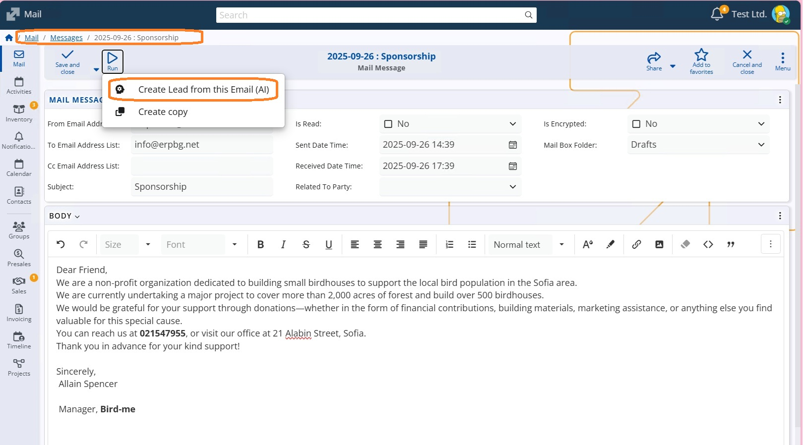
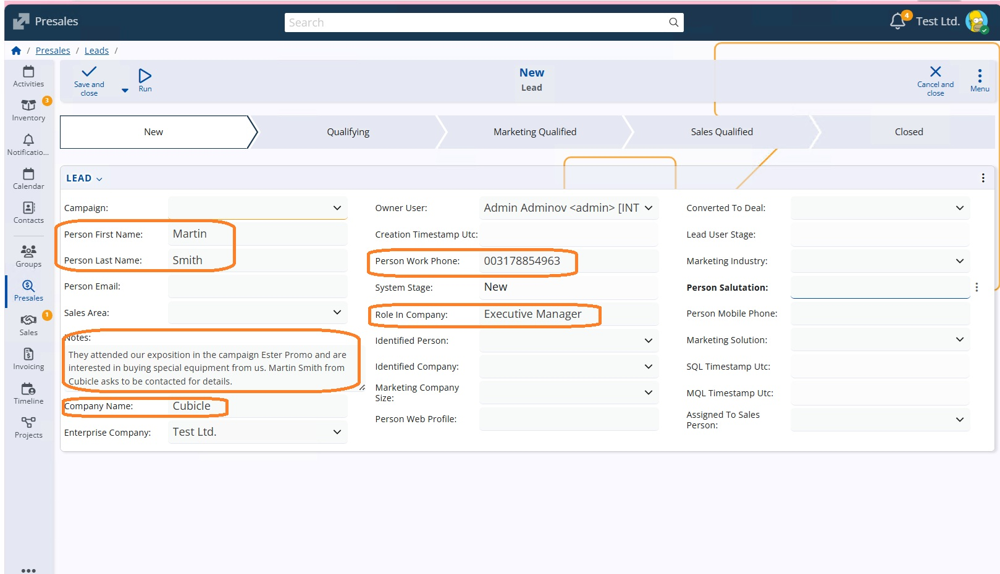

# Create Leads from Text or Email (AI)

@@name provides AI-assisted functionality for creating Leads directly from unstructured text or email content. Instead of manually entering lead details, you can let the system extract relevant information automatically and populate the Lead form for you.

This functionality is available through two AI features:
- **Fill data from text or Email (AI)** in the Lead definition
- **Create Lead from this Email (AI)** in the Mail business app

## Fill Data from Text or Email (AI)

This option is available when creating or editing a Lead.

### Where to Find It

1. Open the **Leads** definition.
2. Create a new Lead or open an existing one.
3. In the Lead form, choose **Fill data from text or Email (AI)**.

### How It Works

When you select this option, you can provide:
- Free-form text (for example, copied from an email, website, or message), or
- The content of an email

The AI analyzes the provided content and automatically recognizes and fills in relevant Lead attributes, such as:

- Lead name
- E-mail address
- Company
- Telephone
- Title and position
- Any other information relevant to the available form fields

In addition, the AI generates a concise summary of the original text or email and places it in the **Notes** field of the Lead. This allows you to keep the full context without manually reviewing the entire message again.

## Create Lead from This Email (AI)

This option is available directly from the **Mail** business app.

### Where to Find It

1. Open the **Mail** business app.
2. Open an incoming email.
3. Select **Create Lead from this Email (AI)**.

### How It Works

When triggered, the system uses the content of the selected email as input for the AI. The AI:

- Scans the email body and sender information
- Extracts lead-related data and proposes a new Lead
- Automatically fills in recognized fields in the Lead form
- Generates a summary of the email and stores it in the **Notes** section

You can then review the generated Lead, make adjustments if needed, and save it.

## Result

Both options aim to speed up lead creation and reduce manual data entry while preserving the original context of the communication. The generated Lead should always be reviewed before saving to ensure accuracy.

