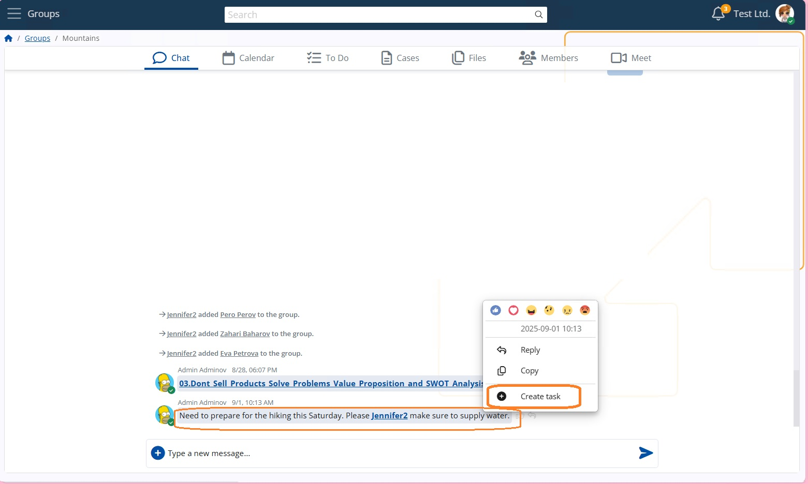

# Create ToDos from Notifications or Chat Comments (AI)

ERP.net provides AI-assisted functionality for creating ToDos directly from notifications or chat comments. This allows users to turn contextual information into actionable tasks without switching screens or manually entering task details.

The functionality is available through two AI features:
- **Create ToDo (AI) from notifications**
- **Create ToDo (AI) from a comment in the chat**

## Create ToDo (AI) from a Comment in the Chat

This option allows users to instantly turn a chat comment into a ToDo without leaving the conversation.

### Where to Find It

1. Open a chat group.
2. Right-click any comment.
3. Select **Create Task**.

### How It Works

When selected, a ToDo modal window opens with automatically prefilled fields:

- **Title** – AI-generated, context-aware, and automatically translated into the user’s working language, regardless of the language used in the original comment  
  - The selected AI model must be marked as **Default**
- **Assigned User** and **Owner User** – default to the task creator
- **Data Object** – linked to the original topic or item
- **Social Group** – automatically linked if the comment originates from a group
- Other relevant fields populated where applicable

To finalize the task:
1. Review the generated values.
2. Click **Create**.

## Result

Once created, the ToDo:
- Is announced automatically in the group chat
- Appears in the **ToDo** tab
- Brings the related group into focus
- Triggers notifications to group members, ensuring important actions are not missed

## Create ToDo (AI) from Notifications

This option allows you to create a ToDo directly from the **Notifications** list.

### Where to Find It

1. Open the **Notifications** list using the bell icon.
2. Select a notification.
3. Choose **Create ToDo (AI)**.

### How It Works

When triggered, the system uses the **notification class of the most recent notification** as contextual input for the AI. Based on this context, the AI automatically generates a ToDo with relevant information prefilled.

This functionality works similarly to task creation from chat comments, but uses notification data as its primary source.

## Benefits

- Faster task creation
- Reduced manual effort
- No context switching
- Improved collaboration through automatic announcements
- Multilingual consistency via AI-generated task titles
