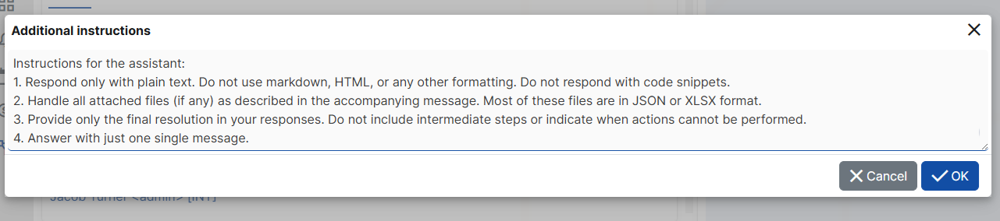
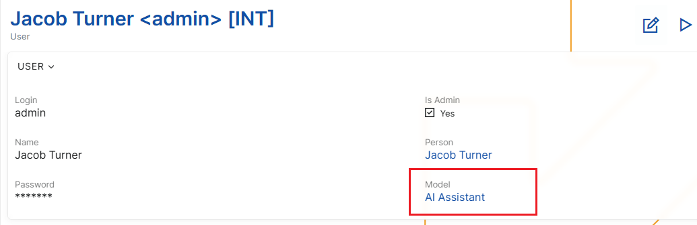
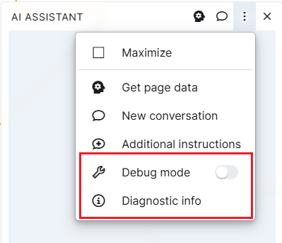

# AI Assistant in @@name

AI Assistant in ERP.net is designed to help users **directly in the context of their work** – without copying data, without switching between systems, and without relying on external tools.

It is not just a generic AI chat, but a deeply integrated assistant that:

* understands where you are in the system;
* can work with the data from the current screen;
* respects ERP.net access permissions;

## What is the @@name AI Assistant?

AI Assistant is a conversational interface embedded in ERP.net, created to support users in their daily tasks.

Instead of searching through documentation or manually formatting text, you can ask AI Assistant to:

* explain the data from the current record;
* summarize information;
* generate text (for example, a User Story);
* validate content.

A key aspect is that the AI Assistant **can work within the current context**.

**Important notes:**

* the AI Assistant model **cannot be fine-tuned**;
* fine-tuning is supported **only for Arbiter models**.

## Where can the AI Assistant be used?

AI Assistant is available in two main places within ERP.net.

### AI Assistant Application

A standalone application accessible from **My Apps**.

It is suitable for:

* general questions;
* quick lookups;
* work without a specific record open.

The application can be pinned for quick access at any time.

### AI Assistant Side Panel

The AI Assistant Side Panel is available in all entity definitions and navigators.

This is the most commonly used way to work with the assistant because:

* it has access to the current record;
* it can work with real on-screen data;
* it supports concrete tasks as part of the working process.

The panel is opened from the three-dot (overflow) menu and can be:

* minimized;
* maximized;
* expanded to full screen.

## Conversations, privacy, and security

Every conversation with the AI Assistant is **personal**.

This means that:

* each user sees only their own conversations;
* conversations are not visible to other users;
* security is enforced by the ERP.net security system.

Even when multiple users work with the same model, their conversations and context remain fully isolated.

## Working with context: Get Data

One of the strongest capabilities of the AI Assistant is its ability to work with the context of the current screen.

When working with a specific record (for example, a Feature, Case, or Document), you can use the **Get Data** button.

It:

* extracts the relevant data from the currently opened record;
* sends it to the AI Assistant as context;
* allows the assistant to base its responses on real data.

Typical scenarios include:

* generating a User Story from a Feature;
* summarizing a record;
* validating whether the data is filled in correctly.

---

## Starting fresh: New Conversation

Over time, the AI Assistant accumulates context from the conversation.

In some cases, this is not desirable – for example, when:

* you change the topic;
* the assistant starts producing inaccurate responses;
* you want a clean start.

In such situations, use **New Conversation**.

This function:

* clears the current conversation history;
* removes the accumulated context;
* starts a new conversation.

## Additional Instructions

Additional Instructions allow you to control how AI Assistant behaves and how it formats its answers — without changing or retraining the underlying model.

This functionality is especially useful when you want the assistant to:

* follow a specific tone or style;

* respond in a predefined format;

* interpret attached files in a particular way;

* apply consistent rules across conversations.

Additional Instructions are **not training**. They do not change the model itself and are applied only as guidance during the conversation.

### How to use them

Open the AI Assistant panel menu (⋮) and select Additional Instructions.

This opens a window with the default (current) instructions for this form.

Here you can:

* Review the instructions to understand how the assistant is currently configured

* Edit them to better match your needs. Add your own rules, for example:
  * ask for shorter answers
  * change the tone
  * define how the assistant should react to certain questions
    
* Experiment freely

After saving, the assistant will immediately use your instructions for your assistant conversations.

If you clear the text, the assistant will automatically continue using the default instructions.

## Models and configuration

Each user in ERP.net has a **Model** setting in their user definition.

This setting determines which AI model is used by the AI Assistant.

Important notes:

* the AI Assistant model **cannot be fine-tuned**;
* fine-tuning is supported **only for Arbiter models**.

### Fine-tuning limitations

The AI Assistant model **cannot be fine-tuned**.

This is not a product limitation, but a technical constraint that comes from the way the AI Assistant is implemented.

AI Assistant is built on top of an API, which works only with base models and does not allow the use of fine-tuned models.  
Because of this, neither Q&A data nor any other form of training can result in model fine-tuning when using the AI Assistant.

Fine-tuning is supported **only for Arbiter (Arbitration) models**, which are designed for rule-based and knowledge-driven scenarios.

## Debugging and support tools

AI Assistant provides diagnostic tools intended primarily for support and development teams.

#### Debug Mode

Debug Info provides:

* request and response details;
* information required for investigating issues.

#### Diagnostic Info

When enabled:

* diagnostic information is added to each AI response;
* token usage and technical details are displayed.

These tools should be used **only when necessary and upon request by the support team**.

## Summary

AI Assistant in ERP.net is designed to be practical, contextual, and adaptable.

When used correctly, it:

* saves time;
* reduces manual effort;
* supports users directly within their working process.
