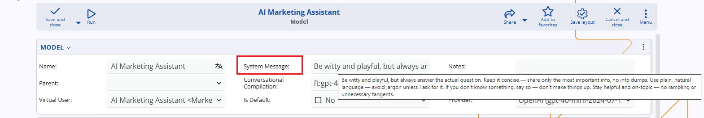
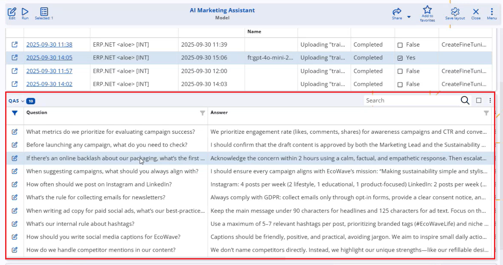
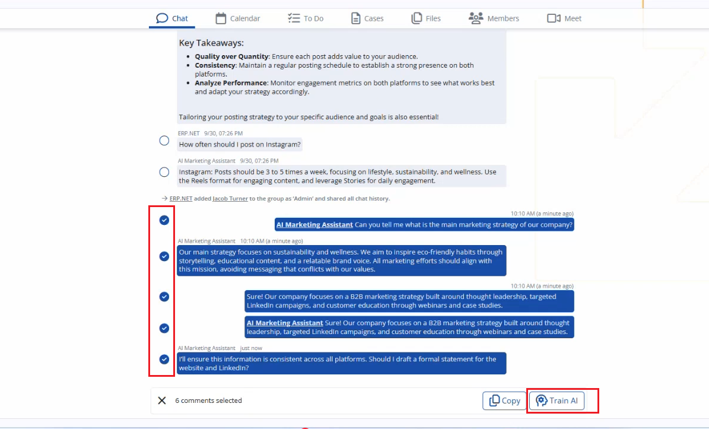
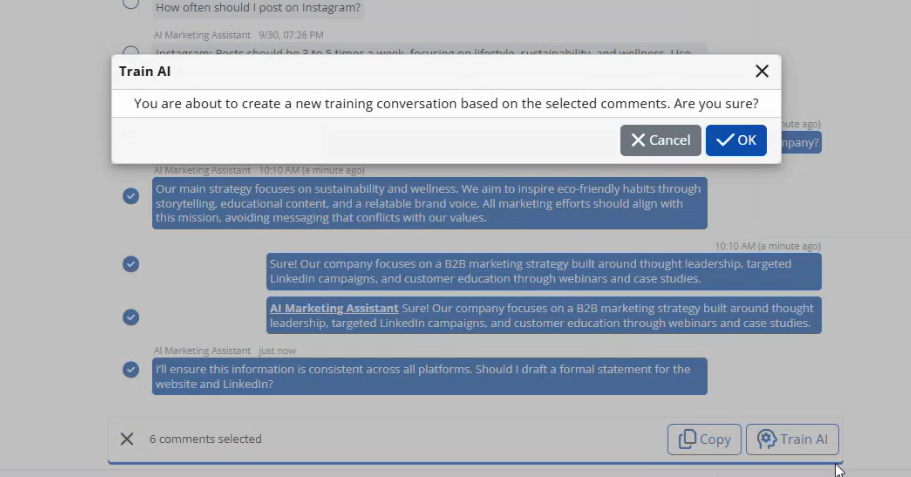
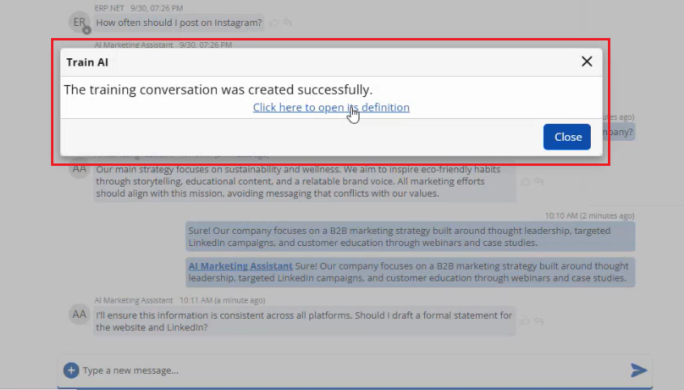

# Fine-tune AI Models in @@name

## What is fine-tuning?

Fine-tuning in @@name means **adapting a base AI model** (from OpenAI) to your company’s specific rules, language, and way of working.

Instead of using a general model that “knows a bit of everything”, you can train specialized assistants such as:

- “AI Marketing Assistant”
- “AI Sales Assistant”
- “AI Support Assistant”
- A company-wide “Master Assistant”

Fine-tuning is done entirely inside @@name, using:

- **System Мessage** – general instructions and behaviour.
- **Q&A records** – structured questions and answers.
- **Training Цonversations** – real chat dialogues that the model has “learned from”.

The result is a model that understands your processes, terminology, and internal rules much better than a generic ChatGPT.

## When do you need fine-tuning?

Fine-tuning is recommended when:

- You want an assistant who **knows your internal procedures**, not just generic best practices.
- You want different models for different departments (Marketing, Sales, Support, etc.).
- You want the model to give **consistent** answers in line with your company policies.

From a technical perspective, fine-tuning is needed when:

- You want to use a **fine-tuned model** (Q&A and/or Training Conversations).
- You want to use a **dedicated AI Assistant** (the *My Assistant* app or assistant panel) with its own behaviour.

In all other scenarios (for example, simple backend AI rules without specialization), @@name can work directly with the **base model** from the AI Provider without fine-tuning.

## Fine-tuning components

Fine-tuning in @@name is built from three main elements:

#### 1. System Message

The **System message** field in the AI Model contains high-level instructions that always apply.

Typical examples:

- “Answer briefly and clearly.”
- “Always use the English language in replies, unless explicitly asked otherwise.”
- “Refer to the company as ‘ERP.BG’ in all messages.”
- “You are a marketing assistant for ERP.BG. You help with social media posts, newsletters, and campaign ideas.”

Good practices:

- Keep it **focused and concise** (up to 5–6 sentences of text).
- Describe **role, tone, language, constraints**.
- Avoid including long policy documents here – those are better suited as Q&A or Training Conversations.

#### 2. QAs

**Q&A records** define explicit question–answer pairs that the model should know.

They are ideal for:

- Internal rules and policies
- Standard operating procedures
- Repetitive “how do we do X in our company?” questions

Examples:

- **Question:** “How often should we post on Instagram?”  
  **Answer:** “Our marketing team posts 4 times per week, with a mix of product, educational, and customer-story posts.”

- **Question:** “What is our rule for collecting e-mails for the newsletter?”  
  **Answer:** “We always ask for explicit consent and follow GDPR opt-in rules…”

When a user asks something similar, the model uses the Q&A data to give an answer that follows your **internal rule**, not generic advice.

#### 3. Training Conversations

**Training Conversations** let you fine-tune the model using **real chat dialogues**.

They are especially useful when:

- You discover the model makes a recurring mistake.
- You want to teach a new topic in a natural, conversational way.
- You prefer to train “while working”, instead of writing static Q&A.

There are two ways to create Training Conversations:

1. **Manually** – by creating records in `Projects.AI.TrainingConversations` and `TrainingConversationMessages`.
2. **Automatically from chat** – using the **Train AI** command.

#### Training from chat (Train AI)

When you are chatting with the AI Arbiter in a group or direct chat:

1. Ask the model a question.
2. If the response is wrong or incomplete, correct it in the chat (explain what is actually correct).
3. When you reach a good answer, right-click (or use the context menu) on the AI’s message and choose **Train AI**.
   

4. Select which messages from the conversation should be included.
   

5. Confirm.
   

@@name will:

- Create a new **Training Conversation** for the corresponding model.
- Store the relevant messages as **Training Conversation Messages**.
- Mark the conversation as available for the next compilation.

This allows you to **improve** the model continuously while using it, without having to pre-invent hundreds of Q&A pairs.

## Compilation and applying the fine-tuning

After you add or change the **System Message**, **Q&A**, or **Training Conversations**, the model must be **compiled** so that the updated fine-tuning is applied at the AI provider.

Compilation:

- packages the current configuration and training data, and  
- creates or updates the runnable model configuration used at runtime.

For detailed, step-by-step instructions on how to run and monitor compilations, see: **[AI Setup – Model compilation](https://docs.erp.net/tech/modules/projects/ai/how-to/setup-ai.html#4-model-compilation)**

In short:

- After a **successful** compilation, the new fine-tuned version becomes active for that model.
- If a compilation **fails**, the last successful version remains active until the issue is resolved and a new compilation completes successfully.

##  Using a fine-tuned model

Once a fine-tuned model is compiled, it can be used as an **arbiter** in chats (added as a member to relevant groups, e.g., Marketing group).

Which users see which behavior depends on which **Virtual User/AI model** is added as a member of the chat group (for arbiters).

## Model hierarchy and reuse

The **Parent** field in the AI Model allows you to build a **hierarchy of models**.

Typical pattern:

- **Master Company Model**  
  Parent: *null*  
  Trained on: general company knowledge, policies, and products.

- **Marketing Model**  
  Parent: *Master Company Model*  
  Trained on: marketing-specific Q&A and conversations.

- **Sales Model**  
  Parent: *Master Company Model*  
  Trained on: sales-specific Q&A and conversations.

The parent can aggregate and reuse training from its children (according to your configuration), so you do not need to copy the same base knowledge to every model.  
This is especially useful for a **company-wide assistant** for managers or general users.

## Best practices for fine-tuning

- Start with a **small scope** – for example, one model for a single department.
- Keep System messages **short and clear**.
- Use Q&A for **fixed rules** and **policies**.
- Use Training Conversations for **real-world examples** and recurring issues.
- Train gradually using **Train AI** during actual work.
- Compile only when there are meaningful changes (to avoid unnecessary waiting).
- Document internally which model is used for which purpose (Marketing, Sales, etc.).

Fine-tuning is not a one-time project – it is an **ongoing process**.  
Over time, as you add more Q&A and Training Conversations, your assistants will become more accurate, more “on brand”, and much more useful for your users.
