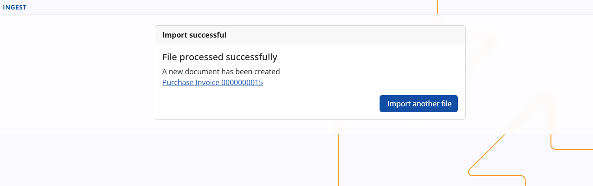
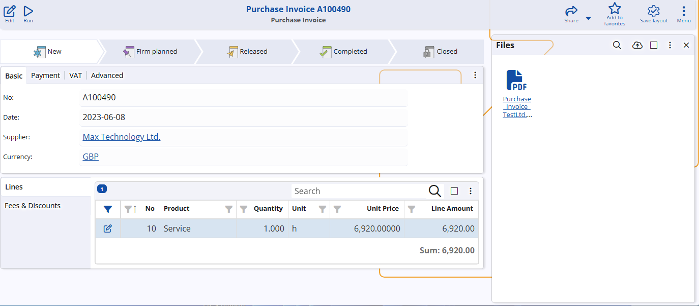

 # Ingest (AI) – Intelligent Import of Purchase Invoices

## What is Ingest AI?

**Ingest AI** is an application in the ERP.net web client that automatically reads and imports purchase invoices into the system.

Instead of manually retyping data from paper or PDF invoices, users can:

- **Snap a photo** of the invoice with their smartphone, or  
- **Upload a file** (image or PDF) from their computer,

Ingest AI converts it into a **structured purchase invoice document** in ERP.net.

**Ingest AI works:**

- On **mobile** – ideal for operational staff and accountants on the go.
- On **desktop** – for office users who drag & drop or select files from their computer.

The result is:

- Less manual data entry  
- Fewer typing mistakes  
- More time for higher-value, expert work instead of repetitive keying

## Primary use case: service purchase invoices

Ingest AI is optimized for **service purchase invoices**, where:

- Suppliers often send **multi-line** invoices, broken down by their internal products/services.
- For accounting and reporting, the customer usually needs **one standard internal product or expense** (e.g. _“External services expense”_, _“Software subscription”_, _“Maintenance fee”_), not the supplier’s detailed breakdown.

### Smart mapping to your internal service product

When a new invoice from a known supplier is imported, Ingest AI:

1. Finds the **most recent purchase invoice** from the same supplier (for up to one year back).
2. If that previous invoice is **single-line**, Ingest AI:
   - Reuses the **internal product** from that line (e.g., your standard “External services” product).
   - Copies the **quantity** and any **user-defined attributes**, if applicable.
   - Uses the **net amount** from the newly recognized invoice.
   - Copies relevant header settings such as:
     - Deal type  
     - Expense center (and revenue center if used)  
     - Notes/description  

This means:

> Even if the supplier sends a multi-line invoice, @@name can work with a **single, standardized line** using **your** internal product for that service, while the detailed supplier structure remains in the attached original document.

### Why this is a good practice

From an accounting and process perspective, this approach:

- Reduces complexity by using **standard internal products** and expense categories.  
- Simplifies **reporting and analysis** – you always see consistent categories, rather than dozens of supplier-specific items.  
- Keeps all supplier details **accessible but not intrusive** – it stays in the scanned/attached document instead of cluttering your accounting lines.

As long as the invoice in the system has:

- Correct supplier and customer  
- Correct invoice number and date  
- Correct totals (net, VAT, currency)  
- The original document is attached  

You do **not** need to replicate the supplier’s line breakdown exactly inside @@name.

## How Ingest AI works – end-to-end flow

### 1. Accessing the application

Ingest AI is available in the @@name web client:

- From the **main menu** (as a business app).
- On both **desktop** and **mobile view**.
- As an installed mobile app (PWA), for quick access.

### 2. Capturing or uploading the invoice

You can provide the invoice to Ingest in several ways:

- **Mobile:**
  - Choose **Camera** and take a photo of a paper invoice.
  - Or pick an existing photo from your gallery.
- **Desktop:**
  - Use **Select File** to browse and upload.
  - Or simply **drag & drop** the file onto the Ingest screen.

Supported formats include:

- Photos (e.g., from a smartphone camera)  
- PDF and other common image formats  

> **Recommendation:** Each file should contain **exactly one invoice**.  
> For multi-page invoices, include **all pages in a single file**.

### 3. AI recognition

Once the file is uploaded, Ingest AI sends it to the AI model, which reads and structures the data. It recognizes core fields such as:

- Document type (e.g., Purchase Invoice, Credit Note)
- Invoice number  
- Invoice date  
- Supplier name  
- Customer (your company)  
- Registration / Tax number  
- Address  
- Total net amount  
- VAT and total amount (depending on configuration)  
- Currency  

The AI is designed to work reliably even with:

- **Scanned** paper invoices  
- **Hand-written** or partially hand-written invoices (where legible)

Names of companies are normalized to avoid problems with:

- Extra dots and dashes  
- Different quote characters  
- Mixed case or spacing  

This improves matching to existing supplier records.

### 4. Reviewing recognized data

After recognition, Ingest AI displays a **“Recognized data”** panel where the user can:

- Review the extracted fields.
- Correct any values (e.g., date, number, supplier match, amount, currency).
- Add or edit notes.

Key fields such as:

- Supplier  
- Customer  
- Document number  
- Date  
- Net amount  
- Currency  

They are visible and editable, so the person has full control before importing.

In most cases, the user simply reviews and presses **Import**, because the recognition accuracy is very high.

### 5. Validation and safety checks

Before creating the purchase invoice in @@name, Ingest AI performs several checks:

1. **Recipient company check**  
   - Ensures that the **customer on the invoice equals the current enterprise company** in @@name.  
   - If there is a mismatch, import is stopped with a clear error message.

2. **Duplicate invoice check**  
   - Checks whether there is an existing, non-voided purchase invoice for:
     - The same supplier  
     - The same document number  
     - The same enterprise company  
   - If a match is found, Ingest AI **blocks** creation of a duplicate invoice.

3. **Document validity**  
   - If the AI cannot recognize the document as a valid purchase invoice (missing supplier, customer, number, date, etc.), the import is not allowed.

These controls ensure that automation **does not** introduce duplicates or incorrect company mappings.

### 6. Creating the purchase invoice

If validation passes and the user confirms:

1. A new **Purchase Invoice** document is created in @@name.  
2. Header fields are filled with the recognized and/or corrected data.  
3. Ingest applies the **smart mapping logic**:
   - Looks up the most recent invoice for this supplier.
   - Reuses the internal product and key settings if that invoice is single-line.
   - Copies deal type, cost center, and notes.
   - Sets the line amount to the net amount of the newly recognized invoice.
4. The original file (image or PDF) is **attached** to the invoice.
5. VAT and other distributed amounts are recalculated automatically based on the totals.

The user then sees:

- The fully created purchase invoice with:
  - VAT and totals  
  - Service line(s)  
- The attached invoice file can be opened directly in the web client without downloading.

The accountant can do a final review and post the document as usual.

## Limitations and known behaviors

- Each uploaded file should contain **one invoice**.  
- Multi-page invoices must be in a **single file** (multi-page PDF or multi-page image).  
- Some environments (like the **new Outlook web interface**) may limit drag & drop directly from email; in such cases, save the file locally first and then upload it to Ingest AI.  
- Response time depends on the AI service; slow or unstable connections to the AI server can increase processing time.

## Requirements

To use Ingest AI, you need:

- **License:** X13 – Advanced AI
- **AI Server site:** An active AI Server Site  
- **AI provider:** At least one configured AI Provider  
- **AI model:** A default AI model 

The technical setup of the AI Server Site, AI Provider, and default model is described here:  [How to set up AI in ERP.net](./how-to/setup-ai.md)
