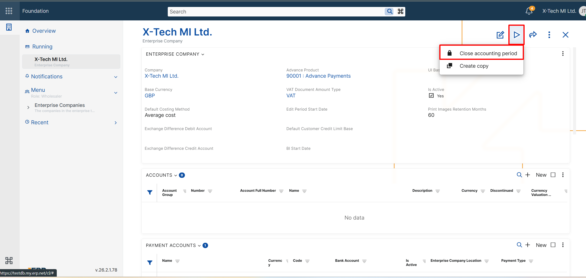

# Accounting

## Notable features

### **1.Transfer Orders: Line-level posting using calculated attributes**

Accounting templates for **Transfer Orders** now support a new **Amount source**:

- **Transfer Orders – Lines**

When this source is selected, the **Amount on** field can reference a **calculated attribute defined for transfer order lines**. This enables line-level posting, where the posted amount is derived per line via calculated attributes. A common use case is posting **additional amounts** (e.g. transport and other costs) that are allocated and calculated per line, so the distributed amounts can be posted to different accounts depending on the line context (e.g. product type) — a common requirement for SAF-T aligned charts of accounts.

**Typical use case**
- You enter additional amounts (transport/overheads) for a transfer order.
- You need the distributed portion of these amounts to be posted per line to the correct accounts (e.g. separate accounts for goods/materials/finished goods), without requiring users to split transfer orders by product type.

**How it works**
1. Define calculated attributes for **Transfer Order Lines** to calculate the desired line-level amount (e.g. allocated transport).
2. In the accounting template for the transfer order, set:
   - **Amount source** = *Transfer Orders – Lines*
   - **Amount on** = the relevant line calculated attribute
3. The generated postings can now reflect the distributed amounts per line.

### **2.Enterprise Companies: Close accounting period**

A new UI function, **Close accounting period**, is now available in the definition of each **Enterprise Company** in both the **Web Client** and the **Desktop Client**.

The function helps users close accounting periods in a safer and more controlled way. 

Instead of allowing manual date entry, the system automatically suggests the next valid closing date:

- If no accounting period has been closed yet, the suggested date is the **last day of the previous calendar month**.
- If a period has already been closed, the suggested date is the **last day of the next calendar month** after the last closed period, but never later than the **last day of the previous month**.

After confirmation, the system sets all eligible accounting vouchers for the selected enterprise company to state **Closed** and updates the **End Date Of Closed Accounting Period** field in the Enterprise Company's definition.

If there are no vouchers to close for the suggested period, the system still updates the closed-period end date. This allows companies to advance the closed accounting period consistently, month by month.

For more details about the closing logic andd eligibility conditions, see [Close accounting period](/modules/financials/accounting/accounting-vouchers/close-accounting-period.md).

