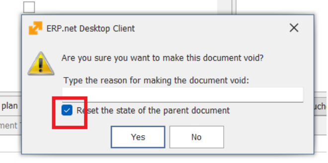
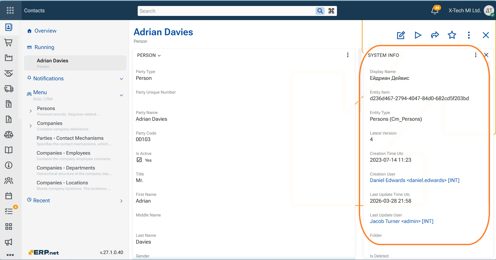

# Breaking changes

## 1. Follow Levels and Notifications Behavior

Notifications now depend on the Follow Level of objects. All existing follows have been migrated to TAGGED. As result the app will appear empty after the update.
In order to have Favorites, you need to mark the objects as such again. 
TAGGED objects deliver chat/comment events only.

➡️ To continue receiving update or implicit notifications, mark important objects as Follow or Favorite.

[Details](https://docs.erp.net/tech/modules/community/social-interactions/notifications/settings.html#follow-levels-and-notifications-behavior)

## 2. JavaScript Enum Handling in User Business Rules

Enum values are now handled as **strings instead of numbers** in JavaScript user business rules.  
Numeric enum comparisons may no longer work as expected.  

➡️ [Details](../user-business-rules/index.md)

## 3. ToDo application shows all Tasks now

The default behavior of the ToDo application has changed.

Linked ToDo tasks are now **visible by default**, whereas previously they were hidden until explicitly enabled by the user. Users who prefer the previous behavior can disable it using the [**/ToDo/ShowLinked** configuration key](https://docs.erp.net/tech/reference/config-options-reference.html#73-todoshowlinked).

➡️ [Details](../my-apps/index.md#1--todo-application--change-in-concept-and-default-behavior)

## 4. At VOID - parent document is not auto-reset anymore

_(versions 2026.2.1.60 up to 26.2.1.89)_

When performing **Void** from inside a **document form**, the parameter **`Reset the state of parent document`** is no longer selected by default. This change prevents unnecessary processing. The parameter can still be selected manually if needed.

- This change only applies when Void is executed from the document form.
- The behavior **remains unchanged** when Void is executed from the **Document Route** or the **Navigator**.

## 5. At VOID - parent document reset default is now configurable

In versions 26.2.1.60 up to 26.2.1.89, when performing Void from a document form, the parameter Reset state of parent document is not selected by default. This was introduced to prevent unnecessary processing.

Starting with 26.2.1.90, this behavior is configurable per instance through the configuration key:[/Documents/DefautResetStateOfParentDocument](https://docs.erp.net/tech/reference/config-options-reference.html#77-documentsresetstateofparentdocument)

During update to 26.2.1.90, the system creates this key with value 1. This restores the previous default behavior for upgraded instances.

So in practice: 
- 26.2.1.60 to 26.2.1.89 → breaking-change behavior №4 applies.  
- 26.2.1.90 and later → administrators can choose the behavior for their instance.

This applies to Web Client and Windows Client.

## 6. Enterprise Company Location is now required in documents

Starting with version 26.2, documents require a value in **Enterprise Company Location** field.

This may affect databases where some **Enterprise Companies** do not have any defined **Company Locations**. In such cases, users may be unable to create or save documents because there is no available value to select for **Enterprise Company Location**.

To prevent this issue during upgrade, the system runs an update procedure that:

- creates a default **Company Location** for each **Enterprise Company** that has none;
- fills **Enterprise Company Location** in existing documents where the field is empty, using the newly created **Company Location**.

The created **Company Location** uses the following name:

- **en:** Head Office
- **bg:** Централен офис

As a result, all **Enterprise Companies** will have at least one available **Company Location**, and existing documents with missing **Enterprise Company Location** values will be updated automatically.

##  7. System object is now created for every aggregate root

⭐ ERP.net now creates a **system object for every business object that is an aggregate root**. This means the system maintains a consistent object registry across the entire domain model.

⭐ As a result, **Track Changes Level 1 is now effectively enabled for all aggregate roots**. Because every aggregate root now has a system object, the platform can consistently maintain the basic tracking metadata for all objects, including:
- the object creator
- creation time
- last update time

This provides system-wide minimum tracking coverage out of the box.

⭐ In addition, the system object now stores the object’s **display text** in a dedicated field. This makes the system object more useful in practical scenarios where a human-readable object title is needed, for example:
- search results
- selection dropdowns
- lists and folders
- cross-entity navigation
- AI-related scenarios

### Overall impact

This change is important because it gives ERP.net a **uniform registry of business objects** across the system.

It improves:
- traceability
- object discovery
- recency-based scenarios
- human-readable object identification
- future extensibility for cross-entity and AI features
  

