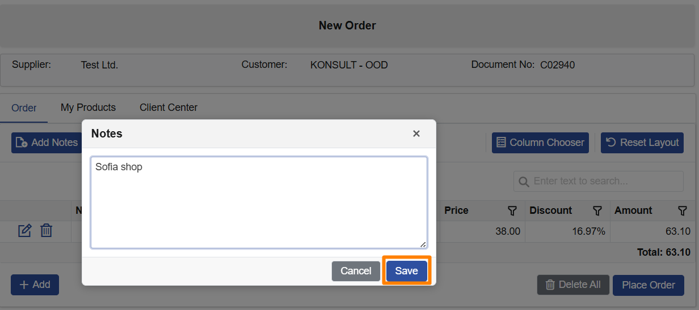

В изречението за Notable features бих махнал “currently delivered”, за да не звучи сякаш има само “temporary state”. По-неутрално:
Major Client Center highlights for v26.2 will be listed here when applicable. For other delivered items, see **Other features** below.
Ако искате по-“release note” тон, можеш да смениш “This page summarizes…” с “This page lists…”, но сегашното е ок.
Ето предложената финална версия (минимални промени):

# Client Center

This page summarizes the Client Center improvements delivered in v26.2. It is updated as related cases are completed.

## Notable features

Major Client Center highlights for v26.2 will be listed here when applicable. For other delivered items, see **Other features** below.

## Other features

1. **Notes on order creation (Client Center)**  
   When creating a **New Order** in Client Center, users can now add a short **Notes** text directly in the **Order** tab. This is useful for delivery instructions, preferences, or other clarifications that should reach the fulfillment team immediately—without follow-up emails or calls. The field is optional and does not block order creation when left empty. Notes are stored in [General.Documents.Documents.DocumentNotes](https://docs.erp.net/model/entities/General.Documents.Documents.html#documentnotes).

   

   
