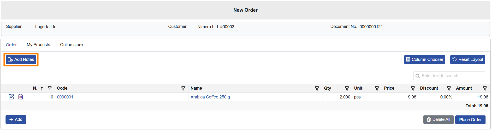
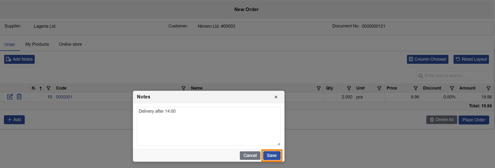

# Client Center

This page summarizes the Client Center improvements delivered in v.26.2. It is updated as related cases are completed.

## Notable features

Major Client Center highlights for v.26.2 will be listed here when applicable. For other delivered items, see **Other features** below.
&nbsp;

## Other features

### **1. Notes for orders**  

  Small clarifications (delivery instructions, preferences, internal handling details) can make a big difference during fulfillment. In v.26.2, Client Center makes it easier to capture these details and keep them visible throughout the order flow.  
   - Add notes while creating a [**New Order**](https://docs.erp.net/tech/modules/crm/clientcenter/orders/new-order.html#notes) (via **Add Notes/Notes**).  
   - Review notes in the [**order document**](https://docs.erp.net/tech/modules/crm/clientcenter/orders/orders.html#order-document) header.  
   - Optionally show notes as a column in the [**Orders**](https://docs.erp.net/tech/modules/crm/clientcenter/orders/orders.html#details) list (via [Column Chooser](https://docs.erp.net/tech/modules/crm/clientcenter/grid-control.html#column-chooser)).

   Notes are optional and don’t block order creation when left empty. Notes are stored in [General.Documents.Documents.DocumentNotes](https://docs.erp.net/model/entities/General.Documents.Documents.html#documentnotes).

   

   

### **2. Files panel in Customer Profile**  

  Customer documents now have their own dedicated space in Client Center. With the new **Files** panel in **Customer Profile**, external users can easily access and share files—without unnecessary back-and-forth over email.  
   - View and download files attached to the customer and shared with external users.  
   - Upload new files directly from Client Center (saved to the customer record).  
   - Available for roles **L40 (Billing)** and above.  

   If there are no accessible documents, the panel displays the message **"No documents available."**
