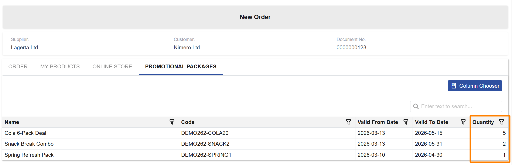
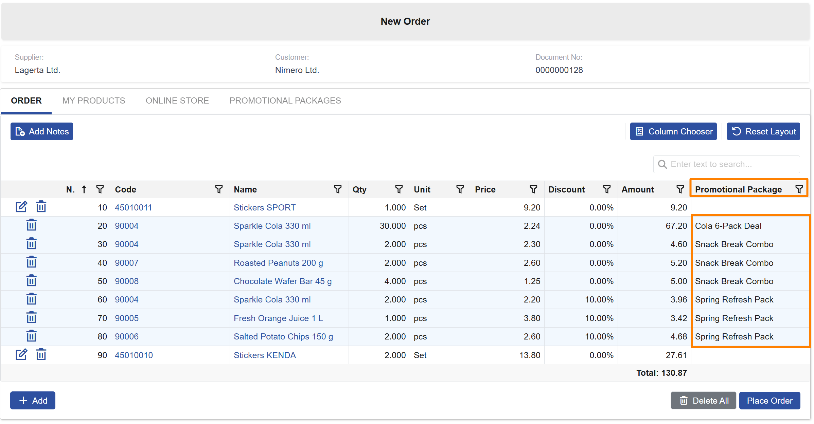
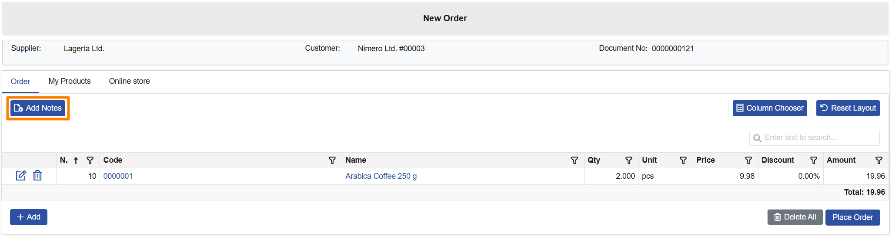
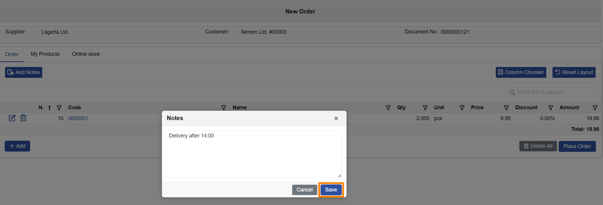
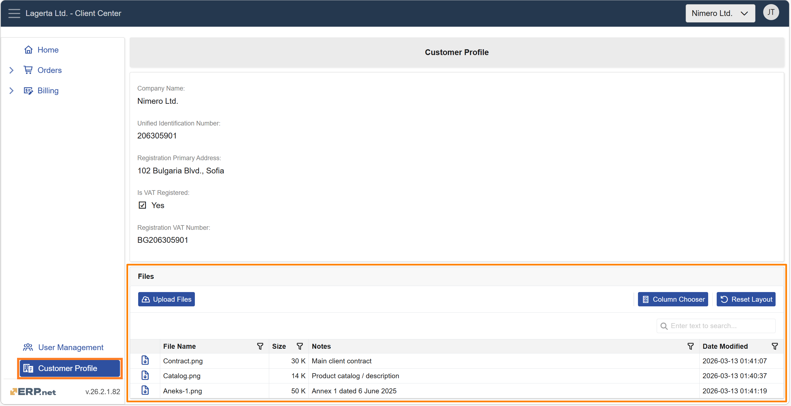
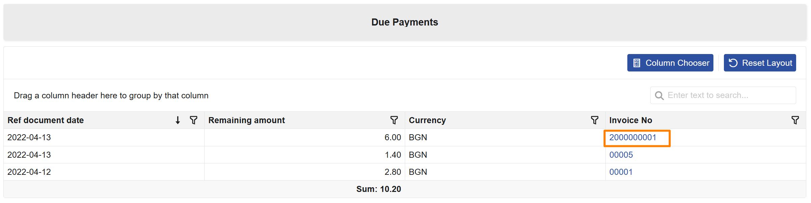

# Client Center

This page summarizes the Client Center improvements delivered in v.26.2. It is updated as related cases are completed.

## Notable features

### 1. Promotional Packages Available in New Order 

Promotional offers are more useful when customers can see and order them directly during self-service, without relying on a sales representative. In v.26.2, Client Center now supports Promotional Packages in [**New Order**](https://docs.erp.net/tech/modules/crm/clientcenter/orders/new-order.html#promotional-packages), bringing the experience closer to desktop sales and making promotional offers visible at the moment of ordering.

**Key capabilities:**

   - Customers can view the promotional packages available to them while [**creating a New Order**](https://docs.erp.net/tech/modules/crm/clientcenter/orders/new-order.html#create-a-new-order).
   - Customers can add a package directly to the order by entering a quantity in the [**Promotional packages**](https://docs.erp.net/tech/modules/crm/clientcenter/orders/new-order.html#promotional-packages) panel.
   - The system automatically adds the corresponding package lines to the [**Order tab**](https://docs.erp.net/tech/modules/crm/clientcenter/orders/new-order.html#create-a-new-order).
   - Promotional package lines are visually distinguished and remain non-editable after they are added.

## Other features

### 1. Notes Entry During Order Creation 

Small clarifications (delivery instructions, preferences, internal handling details) can make a big difference during fulfillment. In v.26.2, Client Center makes it easier to capture these details and keep them visible throughout the order flow.

**Key capabilities:**

   - Customers can add notes while creating a [**New Order**](https://docs.erp.net/tech/modules/crm/clientcenter/orders/new-order.html#notes) via **Add Notes/Notes**.
   - Notes are displayed in the [**order document**](https://docs.erp.net/tech/modules/crm/clientcenter/orders/orders.html#order-document) header when reviewing the order later.
   - Notes can also be shown in the [**Orders**](https://docs.erp.net/tech/modules/crm/clientcenter/orders/orders.html#details) list as an optional column via the [**Column Chooser**](https://docs.erp.net/tech/modules/crm/clientcenter/grid-control.html#column-chooser).
   - Notes remain optional and do not block order creation when left empty.
     
   

   

### 2. Customer-Related Documents in Customer Profile  

  Customer documents now have their own dedicated space in Client Center. With the new **Files** panel in [**Customer Profile**](https://docs.erp.net/tech/modules/crm/clientcenter/index.html#customer-profile), external users can easily access and share files—without unnecessary back-and-forth over email.

  **Key capabilities:**  
   - View and download files attached to the customer and shared with external users.  
   - Upload new files directly from Client Center. Uploaded files are saved to the customer record and shared with internal and external users..  
   - Available for roles **L40 (Billing)** and above.  

   If there are no accessible documents, the panel displays the message **"No documents available."**

   
  
### **3. Direct Invoice Access from Due Payments**  

When reviewing unpaid obligations, customers often need to inspect the related invoice before taking action. In v.26.2, Client Center makes this easier by allowing direct access to invoice details from [**Due Payments**](https://docs.erp.net/tech/modules/crm/clientcenter/billing/due-payments.html), removing the need to manually search for the invoice in [**Invoices**](https://docs.erp.net/tech/modules/crm/clientcenter/billing/invoices.html).

**Key capabilities:**

   - Customers can open an invoice directly from the **Invoice No** link in [**Due Payments**](https://docs.erp.net/tech/modules/crm/clientcenter/billing/due-payments.html).
   - Clicking the invoice number opens the same invoice document view available in [**Invoices**](https://docs.erp.net/tech/modules/crm/clientcenter/billing/invoices.html#invoice-document).
   - If the invoice is not accessible because of Client Center restrictions, the system shows an informative message instead of a system error.

