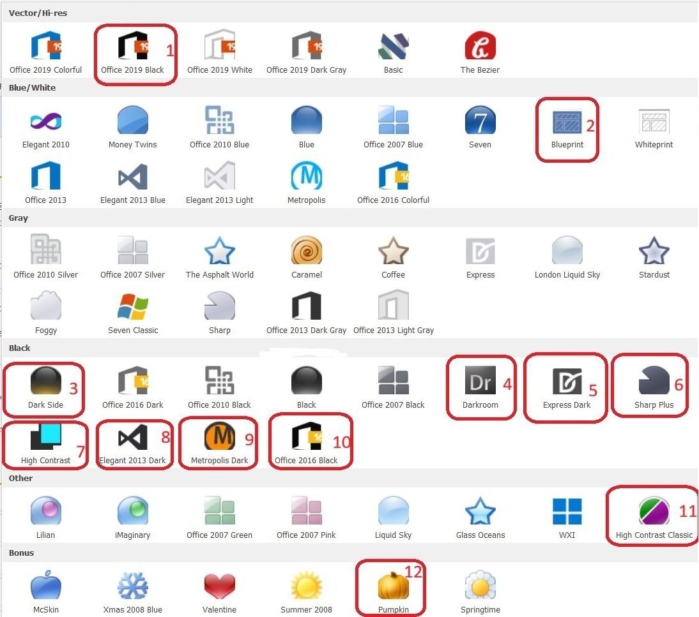

# Desktop Client

WIN Client also undergoes improvements and transformations, although less frequently. Here are some of the novelties introduced in version 26.2.

## Notable features

### **1.Unsupported Dark Themes Disabled by Default**

We have identified several dark themes in the Desktop Client that contain visual issues. These themes will not be fixed. Instead, we are introducing a configuration option:

["UseUnsupportedThemes"](https://github.com/ErpNetDocs/tech/blob/master/reference/config-options-reference.md#74-useunsupportedthemes) in Settings menu

- Disabled (default): Unsupported themes are inactive and cannot be applied.
- Enabled: The themes can be used at your own discretion.

> [!IMPORTANT] 
> After upgrading, if an unsupported theme is currently in use, it will automatically revert to a supported theme.
> If you still wish to use these themes, you must explicitly enable UseUnsupportedThemes after the update.

## Other features

### **1. Greater control over desktop notifications

Until now, every incoming notification automatically appeared as a blue pop-up balloon, occasionally obstructing part of the screen. With the new configuration option ["AllowNotificationPopups"](https://docs.erp.net/tech/reference/config-options-reference.html#72-allownotificationpopups), this behavior is now fully controllable. The setting is in Settings menu.
