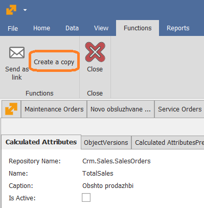
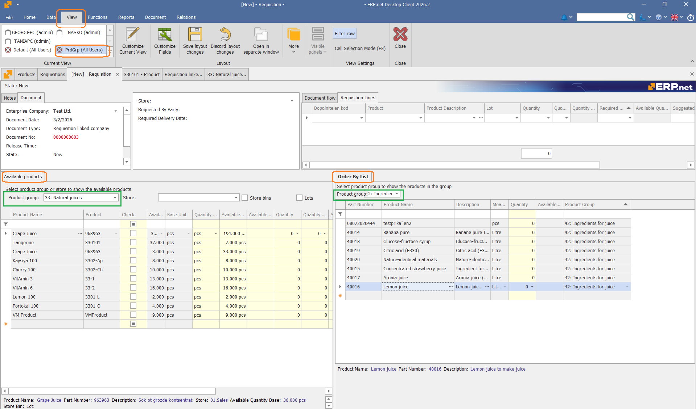
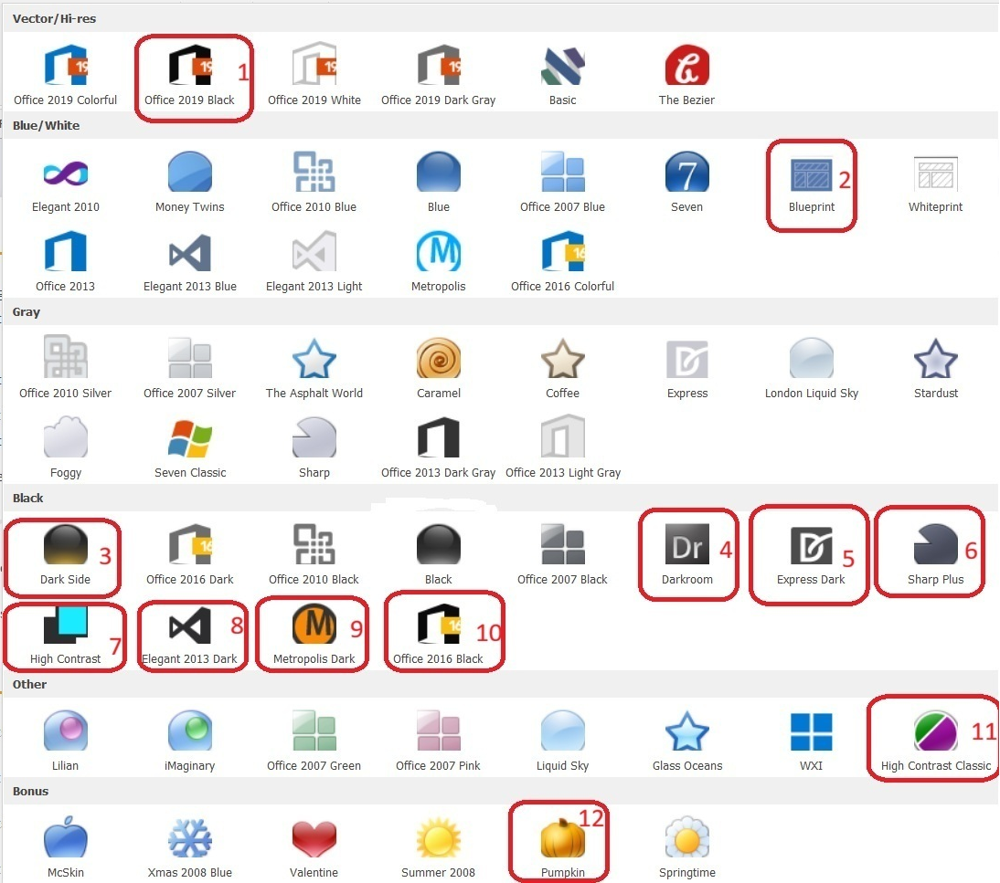
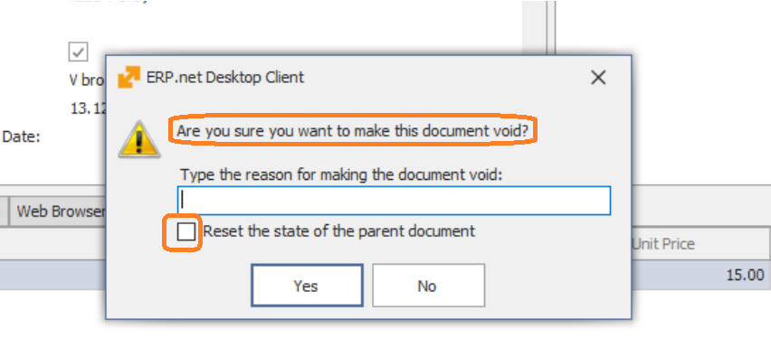

# Desktop Client
WIN Client also undergoes improvements and transformations, although less frequently. Here are some of the novelties introduced in version 26.2.

## ⚠️ Breaking Changes

- [At VOID - parent document is not auto-reset anymore](https://docs.erp.net/tech/whats-new/v26-2/breaking-changes/index.html#4-at-void---parent-document-is-not-auto-reset-anymore)

## Notable features

## Other features

### **1. Greater control over desktop notifications**

Until now, every incoming notification automatically appeared as a blue pop-up balloon, occasionally obstructing part of the screen. With the new configuration option ["AllowNotificationPopups"](https://docs.erp.net/tech/reference/config-options-reference.html#72-allownotificationpopups), this behavior is now fully controllable. The setting is in Settings menu.

### **2. Create a Copy of a Calculated Attribute** 

We’ve introduced a new option in the Desktop Client that allows you to create a copy of an existing calculated attribute.

This function duplicates the attribute’s parameters and all associated expressions, so you don’t need to recreate complex logic from scratch. After copying, you only need to adjust the Repository and Name and modify any parameters as required for the new purpose.

This enhancement significantly reduces the effort involved in building similar or identical calculated attributes and helps prevent errors when re-entering complex expressions.

### **3. Save Product group in the view** 

When you select a Product group in a form (e.g. Requisition, panels "Order by list" and "Available products"), the selected value can now be _saved in the form view_. The next time you open the form, the same Product group will be preselected and the product list will already be filtered accordingly.

👉 Saves time when working repeatedly with the same product group  
👉 Reduces repetitive filtering actions 
👉 Improves efficiency when creating new requisitions from scratch

### **4. Unsupported dark themes disabled by default**

We have identified several dark themes in the Desktop Client that contain visual issues. These themes will not be fixed. Instead, we are introducing a configuration option:

["UseUnsupportedThemes"](https://github.com/ErpNetDocs/tech/blob/master/reference/config-options-reference.md#74-useunsupportedthemes) in Settings menu

- Disabled (default): Unsupported themes are inactive and cannot be applied.
- Enabled: The themes can be used at your own discretion.

> [!IMPORTANT] 
> After upgrading, if an unsupported theme is currently in use, it will automatically revert to a supported theme.
> If you still wish to use these themes, you must explicitly enable UseUnsupportedThemes after the update.
> You must log out and log in again for the change to take effect.

### **5. At VOID - parent document is not auto-reset anymore**

_(Breaking change)_

When performing **Void** from inside a **document form**, the parameter **`Reset the state of parent document`** is no longer selected by default. This change prevents unnecessary processing. The parameter can still be selected manually if needed.

- This change only applies when Void is executed from the document form.
- The behavior **remains unchanged** when Void is executed from the **Document Route** or the **Navigator**.

