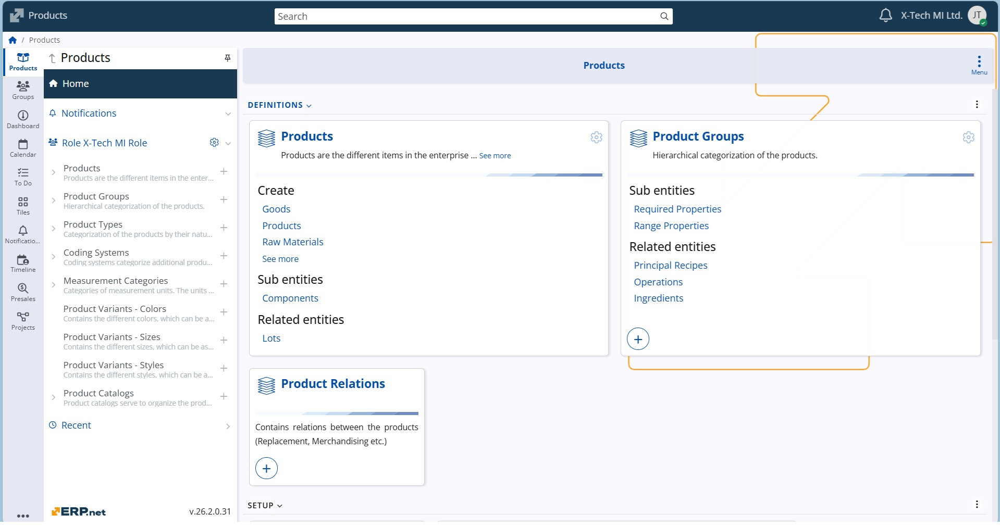

# Product Management

The **Product Management** module is the heart of product data management — where all products are defined, structured, and connected within the system.
Its purpose is to ensure complete, accurate, and consistent product information throughout the entire lifecycle — from definition and maintenance to sales, service, and analytics.

### Notable features
[!list folder="." depth=1 limit=100 default-text="None"]

### Other features
