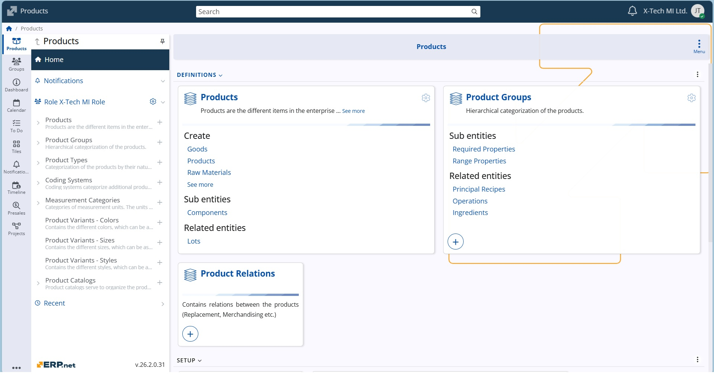

# Product Management
The **Product Management** module is the heart of product data management — where all products are defined, structured, and connected within the system.
Its purpose is to ensure complete, accurate, and consistent product information throughout the entire lifecycle — from definition and maintenance to sales, service, and analytics.

## Notable features

### Introduction of a new entity ["Product Relations"](product-relations/index.md)

With the latest update, we’re introducing a new concept: _Product Relations_, bringing more flexibility, clarity, and automation to the way products are connected.
This functionality is implemented through two new tables:

🧩 Product Relation Types – define what kind of relationship exists between products (e.g., Replacement, Fitment, Merchandising). 
🔗 Product Relations – store the actual links between products (from → to), including validity dates and quantity factors.

This brings to the table new features and functions too.

## Other features

### 1. Replace a product

### 2. Add a related product
